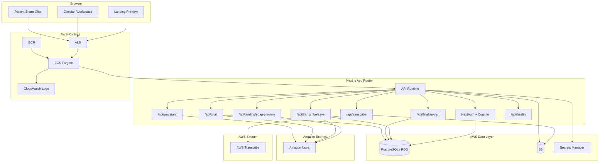

# AWS + Amazon Nova Integration Deep Dive

## Overview

This document explains how Synth uses AWS to deliver authentication, transcription, generation, storage, and deployment for the current codebase.

It covers:

- Amazon Nova integration
- Cognito-backed authentication
- AWS Transcribe server audio processing
- PostgreSQL + Prisma runtime behavior
- ECS / RDS / S3 / Secrets Manager deployment shape
- runtime configuration and deployment requirements

Synth now supports a full AWS-first application path:

- Cognito for clinician identity
- AWS Transcribe for server-side audio transcription
- Bedrock / Nova for summary, SOAP, assistant, and grounded chat generation
- RDS for application data
- ECS Fargate for runtime hosting

## System Summary

Synth uses AWS services in four main layers:

### 1. Identity

- Amazon Cognito is the primary clinician auth provider when configured.
- NextAuth remains the session layer in the app.
- Prisma stores the application user record and links Cognito users by `cognitoSub`.
- Credentials auth can still be allowed for local or fallback environments via `ALLOW_LEGACY_CREDENTIALS`.

### 2. AI generation

Amazon Nova through Bedrock powers:

- conversation summaries
- SOAP note generation
- grounded clinician chat
- grounded patient chat
- report generation
- in-app assistant responses

### 3. Audio transcription

AWS Transcribe powers server-side audio transcription:

- upload audio to S3
- start a transcription job
- retrieve transcript output
- normalize output into the app’s `TranscriptSegment` structure
- pass transcript segments into the existing clinical documentation pipeline

### 4. Application runtime

- Next.js runs on ECS Fargate
- PostgreSQL runs on RDS
- runtime secrets come from Secrets Manager
- logs go to CloudWatch

## High-Level Architecture



## Where Amazon Nova Is Used

### Visit summary generation

File: `src/lib/clinical-notes.ts`

`generateConversationSummary(...)` formats speaker-timed transcript segments and sends them to Amazon Nova. If Nova fails, the app falls back to deterministic summary generation.

### SOAP note generation

File: `src/lib/clinical-notes.ts`

`generateSoapNotesFromTranscript(...)` prompts Nova to produce a structured SOAP note from transcript segments. If Nova fails, the app returns a deterministic SOAP scaffold.

### Grounded chat

File: `src/app/api/chat/route.ts`

The chat runtime loads visit context from PostgreSQL and generates grounded clinician or patient responses from:

- transcript
- summary
- SOAP note
- additional notes
- appointments
- care plan items
- blood pressure history

Responses stream over SSE and may include citations, source details, and blood pressure visualizations.

### Assistant and report generation

Files:

- `src/app/api/assistant/route.ts`
- `src/app/api/soap-actions/[visitId]/report/route.ts`

These routes also use the shared Nova provider layer.

## Bedrock Provider Layer

File: `src/lib/nova.ts`

Responsibilities:

- initialize `BedrockRuntimeClient`
- send `ConverseCommand` requests
- normalize Bedrock responses into plain text
- expose shared generation helpers

Exported API:

- `generateNovaText(...)`
- `generateNovaTextFromMessages(...)`
- `isNovaConfigured()`

Defaults:

- text model: `amazon.nova-lite-v1:0`
- fast model: `amazon.nova-micro-v1:0`

## Cognito Authentication

Files:

- `src/lib/auth.ts`
- `src/app/login/page.tsx`
- `src/types/next-auth.d.ts`

### Auth model

The app uses NextAuth as the session and callback layer, with Cognito as the primary identity provider when configured.

Behavior:

- if Cognito config is present, the Cognito provider is enabled
- if Cognito is not configured, credentials auth remains available
- if Cognito is configured and `ALLOW_LEGACY_CREDENTIALS=true`, both auth modes are allowed

### User linking

On Cognito sign-in:

- the app reads the Cognito provider account ID
- links an existing Prisma `User` by `cognitoSub`
- or links by email if a local user already exists
- or creates a new `User` row if neither exists

Prisma `User` fields now support:

- `cognitoSub`
- `authProvider`
- nullable `passwordHash`

This keeps Cognito responsible for identity while Prisma remains the source of application user metadata, onboarding state, visit ownership, and role data.

## AWS Transcribe Integration

Files:

- `src/lib/transcribe.ts`
- `src/app/api/transcribe/route.ts`
- `src/components/transcribe/TranscribeRecorder.tsx`

### Runtime flow

1. Browser records audio.
2. The app posts the audio file to `POST /api/transcribe`.
3. The server uploads the file to S3.
4. The server starts an AWS Transcribe job.
5. The app polls AWS Transcribe for completion.
6. The returned transcript JSON is normalized into `TranscriptSegment[]`.
7. The UI then saves the transcript through the existing visit documentation flow.

### Normalization behavior

The Transcribe adapter:

- detects media format from file name or MIME type
- requests speaker labels
- maps speaker labels into `patient` / `clinician`
- groups transcription items into coherent transcript segments
- falls back to sentence splitting if detailed speaker output is missing

## Data Layer

File: `prisma/schema.prisma`

Core entities:

- `User`
- `Patient`
- `Visit`
- `VisitDocumentation`
- `ShareLink`
- `Appointment`
- `CarePlanItem`
- `GeneratedReport`

The current schema supports both AWS identity integration and persisted clinical workflows without splitting user identity into a separate application data model.

## Health and Readiness

File: `src/app/api/health/route.ts`

The health endpoint now reports:

- database reachability
- Nova configuration
- auth configuration
- public URL configuration
- uploads bucket wiring
- Cognito configuration state
- Transcribe configuration state
- whether legacy credentials auth is enabled

This is also the ALB health check endpoint in Terraform.

## AWS Infrastructure Scaffold

Terraform files:

- `infra/terraform/main.tf`
- `infra/terraform/variables.tf`
- `infra/terraform/outputs.tf`
- `infra/terraform/terraform.tfvars.example`

### Provisioned resources

The scaffold includes:

- ECR repository
- ECS cluster
- ECS task definition and Fargate service
- ALB, listener, and target group
- CloudWatch log group
- RDS PostgreSQL instance
- DB subnet group
- security groups
- Secrets Manager secret
- S3 bucket
- IAM roles and policies

### Runtime environment injection

Terraform injects:

- AWS region
- Nova model IDs
- public app URLs
- Cognito issuer and client ID
- Transcribe language code
- uploads bucket name
- legacy credentials toggle

Secrets Manager provides:

- `DATABASE_URL`
- `DIRECT_URL`
- `NEXTAUTH_SECRET`
- `COGNITO_CLIENT_SECRET`

### IAM expectations

The ECS task role needs access for:

- `bedrock:InvokeModel`
- `bedrock:InvokeModelWithResponseStream`
- `transcribe:StartTranscriptionJob`
- `transcribe:GetTranscriptionJob`
- `secretsmanager:GetSecretValue`
- `s3:GetObject`
- `s3:PutObject`
- `s3:ListBucket`

## Environment Contract

Defined in `.env.example`:

```env
DATABASE_URL="postgresql://postgres:<PASSWORD>@<RDS_HOST>:5432/postgres"
DIRECT_URL="postgresql://postgres:<PASSWORD>@<RDS_HOST>:5432/postgres"

AWS_REGION=us-east-1
BEDROCK_NOVA_TEXT_MODEL_ID=amazon.nova-lite-v1:0
BEDROCK_NOVA_FAST_MODEL_ID=amazon.nova-micro-v1:0
TRANSCRIBE_LANGUAGE_CODE=en-US

AWS_ACCESS_KEY_ID=
AWS_SECRET_ACCESS_KEY=
S3_BUCKET_AUDIO_UPLOADS=synth-nova-audio-dev

COGNITO_ISSUER=
COGNITO_CLIENT_ID=
COGNITO_CLIENT_SECRET=
ALLOW_LEGACY_CREDENTIALS=false

NEXTAUTH_SECRET=...
NEXTAUTH_URL=http://localhost:3000
NEXT_PUBLIC_APP_URL=http://localhost:3000
```

### Minimum AWS requirements

For the full AWS-native path, the deployed environment needs:

- RDS connection strings
- AWS region
- Nova model IDs
- S3 uploads bucket
- NextAuth secret
- public app URLs
- Cognito issuer, client ID, and client secret

## Deployment Runbook

### 1. Install and verify locally

```bash
npm install
npm run setup
npm run lint
npx tsc --noEmit
npm run build
```

### 2. Build and push the image

Use:

- `scripts/deploy/build-and-push.ps1`

### 3. Configure Terraform variables

Set:

- VPC and subnet IDs
- image URI
- database password
- app URLs
- Cognito values if using Cognito
- Transcribe language code if overriding default

### 4. Apply Terraform

From `infra/terraform/`:

```bash
terraform init
terraform plan
terraform apply
```

### 5. Write runtime secrets

Use:

- `scripts/deploy/set-app-secrets.ps1`

### 6. Run Prisma migrations

Recommended:

```bash
npx prisma migrate deploy
```

### 7. Validate the deployment

Check:

- `/api/health`
- Cognito sign-in if configured
- fallback credentials sign-in if enabled
- landing transcript preview
- server audio transcription
- clinician save flow
- patient share chat

## Troubleshooting

### Cognito is not appearing on `/login`

Check:

- `COGNITO_ISSUER`
- `COGNITO_CLIENT_ID`
- `COGNITO_CLIENT_SECRET`
- NextAuth callback URLs in Cognito

### Cognito sign-in works but no app user is found

Check:

- Prisma migration for `cognitoSub` / `authProvider`
- email consistency between Cognito and Prisma
- database write permissions

### AWS Transcribe route returns configuration errors

Check:

- `AWS_REGION`
- `S3_BUCKET_AUDIO_UPLOADS`
- ECS task IAM permissions for Transcribe and S3

### Nova generation fails

Check:

- Bedrock access enabled
- valid model IDs for the target region
- task IAM permissions

### Database connection fails

Check:

- `DATABASE_URL`
- `DIRECT_URL`
- RDS security group rules
- subnet routing
- migration status

## Practical Readiness Status

Implemented in the codebase:

- Cognito-ready auth flow
- Transcribe-backed server audio transcription
- Nova-backed generation
- Prisma + PostgreSQL runtime
- ECS/RDS/S3/Secrets Manager deployment scaffold

Still dependent on environment setup:

- actual AWS account configuration
- Bedrock access
- Cognito app client setup
- Secrets Manager values
- deployed database migrations
- live AWS infrastructure rollout

## Bottom Line

Synth now has a credible full AWS-native application path:

- Cognito for clinician identity
- AWS Transcribe for server audio transcription
- Bedrock / Nova for clinical generation
- ECS + RDS + S3 + Secrets Manager for runtime and data

Once AWS environment values and infrastructure are in place, the app is ready for an end-to-end AWS deployment and demo.
