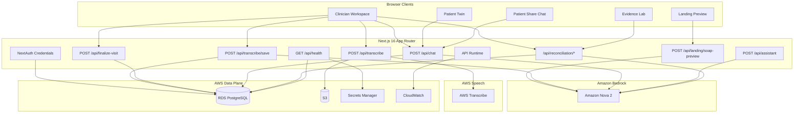
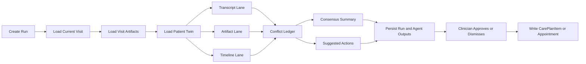
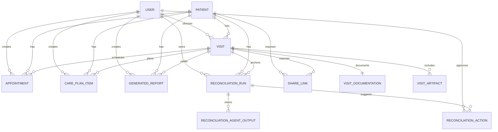

# AWS Amazon Nova Integration Deep Dive

This document describes the current technical architecture of Synth as implemented in this repository. The goal is accuracy, not marketing. It explains where Amazon Nova is on the critical path, where the system uses deterministic fallbacks, how multimodal evidence is handled, how longitudinal memory is built, and how the new Evidence Lab reconciliation workspace actually works.

## Current System Shape

Synth is a clinical workflow application built around five connected capabilities:

- transcript or audio to summary and SOAP generation
- multimodal artifact extraction from clinical images
- longitudinal Patient Twin synthesis across visits
- Evidence Lab reconciliation with persisted agent outputs and approvals
- grounded clinician and patient chat from saved visit records

The implementation is AWS-native at the inference, speech, storage, and deployment layers:

- Amazon Bedrock hosts the Amazon Nova models
- AWS Transcribe handles server-side audio transcription
- Amazon S3 stores uploaded audio for transcription jobs
- Amazon ECS Fargate runs the Next.js application container
- Amazon RDS PostgreSQL stores application state
- AWS Secrets Manager provides runtime secret material
- Amazon CloudWatch stores application logs
- Amazon ECR stores the application image
- Application Load Balancer exposes the public HTTP entry point

## System Goals

The current system is designed to optimize for:

- low-friction hackathon and judge flows
- strong Amazon Nova usage on the documentation and chat paths
- visible multimodal evidence handling
- persistent, reviewable clinician workflows
- longitudinal patient memory instead of single-visit isolation
- deployment on AWS without requiring a pre-existing platform footprint

It is not currently optimized for:

- EHR interoperability
- HIPAA or regulated production posture
- event-driven queue workers
- multi-tenant isolation
- fully model-driven agent orchestration for every internal lane

That distinction matters. The project now has richer surfaces than a pure demo, but it still intentionally favors a coherent, deployable hackathon system over distributed enterprise complexity.

## Repository Map

The files most relevant to this architecture are:

- [`src/lib/nova.ts`](C:/Users/manoj/CascadeProjects/Synth/src/lib/nova.ts)
- [`src/lib/config.ts`](C:/Users/manoj/CascadeProjects/Synth/src/lib/config.ts)
- [`src/lib/clinical-notes.ts`](C:/Users/manoj/CascadeProjects/Synth/src/lib/clinical-notes.ts)
- [`src/lib/transcribe.ts`](C:/Users/manoj/CascadeProjects/Synth/src/lib/transcribe.ts)
- [`src/lib/visit-artifacts.ts`](C:/Users/manoj/CascadeProjects/Synth/src/lib/visit-artifacts.ts)
- [`src/lib/patient-twin.ts`](C:/Users/manoj/CascadeProjects/Synth/src/lib/patient-twin.ts)
- [`src/lib/reconciliation.ts`](C:/Users/manoj/CascadeProjects/Synth/src/lib/reconciliation.ts)
- [`src/lib/auth.ts`](C:/Users/manoj/CascadeProjects/Synth/src/lib/auth.ts)
- [`src/app/api/landing/soap-preview/route.ts`](C:/Users/manoj/CascadeProjects/Synth/src/app/api/landing/soap-preview/route.ts)
- [`src/app/api/transcribe/route.ts`](C:/Users/manoj/CascadeProjects/Synth/src/app/api/transcribe/route.ts)
- [`src/app/api/transcribe/save/route.ts`](C:/Users/manoj/CascadeProjects/Synth/src/app/api/transcribe/save/route.ts)
- [`src/app/api/finalize-visit/route.ts`](C:/Users/manoj/CascadeProjects/Synth/src/app/api/finalize-visit/route.ts)
- [`src/app/api/chat/route.ts`](C:/Users/manoj/CascadeProjects/Synth/src/app/api/chat/route.ts)
- [`src/app/api/reconciliation/runs/route.ts`](C:/Users/manoj/CascadeProjects/Synth/src/app/api/reconciliation/runs/route.ts)
- [`src/app/api/reconciliation/runs/[runId]/route.ts`](C:/Users/manoj/CascadeProjects/Synth/src/app/api/reconciliation/runs/%5BrunId%5D/route.ts)
- [`src/app/api/reconciliation/runs/[runId]/actions/[actionId]/route.ts`](C:/Users/manoj/CascadeProjects/Synth/src/app/api/reconciliation/runs/%5BrunId%5D/actions/%5BactionId%5D/route.ts)
- [`src/app/patient-twin/[patientId]/page.tsx`](C:/Users/manoj/CascadeProjects/Synth/src/app/patient-twin/%5BpatientId%5D/page.tsx)
- [`src/app/reconciliation/[patientId]/page.tsx`](C:/Users/manoj/CascadeProjects/Synth/src/app/reconciliation/%5BpatientId%5D/page.tsx)
- [`prisma/schema.prisma`](C:/Users/manoj/CascadeProjects/Synth/prisma/schema.prisma)
- [`infra/terraform/main.tf`](C:/Users/manoj/CascadeProjects/Synth/infra/terraform/main.tf)

## High-Level Architecture



The important architectural point is that Nova is central, but not universal. Some paths are Nova-first. Others are intentionally deterministic because the product needs to stay inspectable and resilient.

## Operational Modes

At a high level, the application has five runtime modes:

1. public preview
2. authenticated clinician documentation
3. Patient Twin longitudinal review
4. Evidence Lab reconciliation
5. patient share-link chat

These modes share the same database, auth, and AWS infrastructure, but they differ in:

- authorization boundaries
- persistence behavior
- Bedrock dependence
- use of multimodal inputs
- use of longitudinal history

## Public Preview Pipeline

The landing page is the non-authenticated demo path.

Route:

- [`POST /api/landing/soap-preview`](C:/Users/manoj/CascadeProjects/Synth/src/app/api/landing/soap-preview/route.ts)

Inputs:

- transcript text
- transcript text file
- audio file
- optional evidence image

Behavior:

1. If the request is transcript mode, the route parses either structured transcript JSON or plain text into normalized segments.
2. If the request is audio mode, the route requires AWS Transcribe configuration and delegates audio processing to [`transcribeAudioFile()`](C:/Users/manoj/CascadeProjects/Synth/src/lib/transcribe.ts).
3. If an image is attached, the route calls [`extractClinicalImageArtifact()`](C:/Users/manoj/CascadeProjects/Synth/src/lib/visit-artifacts.ts) to normalize the evidence into summary text, findings, vitals, medications, and extracted text.
4. The route sends the transcript plus any artifact evidence context into:
   - [`generateConversationSummary()`](C:/Users/manoj/CascadeProjects/Synth/src/lib/clinical-notes.ts)
   - [`generateSoapNotesFromTranscript()`](C:/Users/manoj/CascadeProjects/Synth/src/lib/clinical-notes.ts)
5. The response returns transcript segments, summary, SOAP note, and any extracted artifact payload.

Persistence behavior:

- no database write

Failure behavior:

- transcript mode can operate without Transcribe
- audio mode returns `503` if Transcribe is not configured
- Nova failures in summary or SOAP generation fall back to deterministic text assembly in [`src/lib/clinical-notes.ts`](C:/Users/manoj/CascadeProjects/Synth/src/lib/clinical-notes.ts)
- image extraction falls back to conservative artifact placeholders if Nova multimodal analysis is unavailable

## Clinician Documentation Pipeline

The authenticated clinician flow has two main API paths:

- [`POST /api/transcribe`](C:/Users/manoj/CascadeProjects/Synth/src/app/api/transcribe/route.ts)
- [`POST /api/transcribe/save`](C:/Users/manoj/CascadeProjects/Synth/src/app/api/transcribe/save/route.ts)

### Server transcription

`/api/transcribe` requires:

- authenticated session
- Nova configuration
- Transcribe configuration

That Nova dependency is a current product choice, not a speech-system requirement. The route treats transcription as part of the end-to-end AI documentation workflow and returns a clear `503` if the environment is not fully configured for that path.

The actual transcription implementation in [`src/lib/transcribe.ts`](C:/Users/manoj/CascadeProjects/Synth/src/lib/transcribe.ts):

1. validates the file type
2. uploads the audio to S3
3. starts an AWS Transcribe job
4. polls until completion
5. downloads the transcript JSON from the returned URI
6. reconstructs diarized transcript segments
7. falls back to sentence-based segmentation if speaker structure is weak

Current speech assumptions:

- up to 2 speakers
- alternating speaker-label to role mapping
- audio formats such as `mp3`, `mp4`, `wav`, `flac`, `ogg`, `amr`, `webm`, and `m4a`

### Save flow

`/api/transcribe/save` is the main persistence route.

Inputs:

- patient name
- normalized transcript segments
- optional evidence image

Behavior:

1. validates the request payload
2. extracts artifact evidence if an image is attached
3. calls Nova-backed summary and SOAP generation with the artifact context included
4. derives the chief complaint from the earliest patient segment
5. writes patient, visit, documentation, artifacts, and share link inside a Prisma transaction

Persistence order:

- `Patient`
- `Visit`
- `VisitDocumentation`
- optional `VisitArtifact`
- `ShareLink`

Important design property:

- Nova generation happens before the database transaction

That keeps the write path short and avoids holding an open transaction across model latency.

## Multimodal Artifact Pipeline

Synth currently supports image evidence artifacts through [`src/lib/visit-artifacts.ts`](C:/Users/manoj/CascadeProjects/Synth/src/lib/visit-artifacts.ts).

The normalized artifact shape includes:

- `summary`
- `extractedText`
- `findings`
- `evidenceSnippets`
- `medications`
- `vitals`
- `instructions`

Supported image MIME types:

- `image/jpeg`
- `image/jpg`
- `image/png`
- `image/webp`
- `image/gif`

The artifact extraction path uses [`generateNovaMultimodalText()`](C:/Users/manoj/CascadeProjects/Synth/src/lib/nova.ts) when Nova is configured. It requests strict JSON output and then normalizes that response into a stable internal shape.

If multimodal Nova is unavailable or fails:

- the file is still accepted
- the artifact becomes a conservative placeholder
- the system records that the evidence was attached
- the product does not overclaim extracted facts

That is a good demo-system behavior because it preserves the visible multimodal workflow without pretending the extraction succeeded.

## Finalize Visit Pipeline

[`POST /api/finalize-visit`](C:/Users/manoj/CascadeProjects/Synth/src/app/api/finalize-visit/route.ts) is a post-processing route that turns a saved visit into additional artifacts such as:

- after-visit summary
- draft SOAP note
- medication count
- symptom count
- extracted follow-up items

Important note:

- this route is not primarily Nova-driven
- it uses [`extractMedicalEntities()`](C:/Users/manoj/CascadeProjects/Synth/src/lib/clinical-entities.ts) and deterministic formatting

That is intentional. It gives the app one reliable post-processing surface even when model behavior is unavailable or inconsistent.

## Patient Twin Pipeline

The Patient Twin implementation lives in [`src/lib/patient-twin.ts`](C:/Users/manoj/CascadeProjects/Synth/src/lib/patient-twin.ts).

It loads all visits for a patient scoped to one clinician and synthesizes:

- active conditions
- medication history
- BP history
- trend signals
- evidence insights
- follow-up risks
- open questions
- next appointment
- open plan items
- longitudinal timeline events
- citations

The Twin is built server-side from persisted data:

- visit documentation
- visit artifacts
- appointments
- care-plan items

Important accuracy note:

- Patient Twin synthesis is deterministic
- it does not make a dedicated Bedrock call to create the Twin object

That is a good design choice for the current product. The longitudinal view stays inspectable, reproducible, and fast.

### Twin-grounded chat

The Twin uses the shared chat route:

- [`POST /api/chat`](C:/Users/manoj/CascadeProjects/Synth/src/app/api/chat/route.ts)

When the clinician UI sets `agentId = synth_patient_twin`, the chat route:

1. loads the normal visit context
2. loads Twin context for the visit
3. builds a Twin-specific prompt
4. selects Twin-aware citations
5. falls back to deterministic Twin answers if Nova is unavailable

This is not a separate chat service. It is a specialization of the existing grounded chat path.

## Evidence Lab Pipeline

Evidence Lab is the most important new technical surface in the codebase.

Relevant implementation files:

- [`src/lib/reconciliation.ts`](C:/Users/manoj/CascadeProjects/Synth/src/lib/reconciliation.ts)
- [`src/app/api/reconciliation/runs/route.ts`](C:/Users/manoj/CascadeProjects/Synth/src/app/api/reconciliation/runs/route.ts)
- [`src/app/api/reconciliation/runs/[runId]/route.ts`](C:/Users/manoj/CascadeProjects/Synth/src/app/api/reconciliation/runs/%5BrunId%5D/route.ts)
- [`src/app/api/reconciliation/runs/[runId]/actions/[actionId]/route.ts`](C:/Users/manoj/CascadeProjects/Synth/src/app/api/reconciliation/runs/%5BrunId%5D/actions/%5BactionId%5D/route.ts)

### What a run is

A reconciliation run is a persisted record that ties together:

- one patient
- one current visit
- one clinician
- one set of lane outputs
- one conflict ledger
- one set of suggested actions

### Run creation behavior

When a clinician creates a run:

1. the server loads the current visit, artifacts, and longitudinal Twin context
2. it creates a `ReconciliationRun` row with `running` status
3. it computes four structured lanes:
   - transcript
   - artifact
   - timeline
   - reconciler
4. it persists `ReconciliationAgentOutput` rows
5. it persists `ReconciliationAction` rows
6. it updates the run with:
   - overall confidence
   - consensus summary
   - supported claims
   - conflicts
   - unresolved questions

### Important honesty point

Evidence Lab is persisted as separate lanes, but the internal implementation is mixed:

- `transcript`, `artifact`, and `timeline` lanes are deterministic analysis functions over saved data
- the final `reconciler` summary can use Nova if configured
- the whole feature is synchronous request/response, not a queue-backed orchestration service

That means Evidence Lab is a real reconciliation workspace, but it is not yet a system of four independent Bedrock worker agents.

### Conflict and action logic

The current conflict ledger specifically looks for patterns such as:

- self-reported good adherence versus refill pressure
- improving BP trend that is still above target
- future appointment scheduled while lab-related work remains open

Suggested actions can create:

- `CarePlanItem`
- `Appointment`

Approval behavior:

1. the clinician calls the action route with `approve` or `dismiss`
2. approved actions write into the live chart
3. `sourceActionId` on `CarePlanItem` and `Appointment` prevents duplicate writes on repeated approvals

That idempotency behavior is important. It makes the Evidence Lab UI safe to click multiple times.

### Evidence Lab flow



## Grounded Chat Pipeline

The shared chat route is implemented in [`src/app/api/chat/route.ts`](C:/Users/manoj/CascadeProjects/Synth/src/app/api/chat/route.ts).

Authorization paths:

- clinician session for chart access
- share token for patient access

Context loading includes:

- transcript
- summary
- SOAP note
- additional notes
- artifacts
- appointments
- care-plan items
- BP history
- optional Patient Twin context

The route sends the final response as SSE-like events:

- `tool_call`
- `tool_result`
- `message_chunk`
- `message_metadata`
- `message_complete`

Important note:

- this is simulated streaming
- the route chunks a final response into incremental events for the frontend
- it is not Bedrock-native token streaming

That tradeoff is acceptable for the current UX because it keeps the client experience responsive while preserving tool metadata and citations.

## Authentication and Session Model

The authentication stack is intentionally conservative:

- NextAuth credentials provider
- Prisma-backed user lookup
- bcrypt password hashes
- JWT session strategy

Relevant file:

- [`src/lib/auth.ts`](C:/Users/manoj/CascadeProjects/Synth/src/lib/auth.ts)

### Credentials authorize flow

On sign-in:

- user is looked up by email
- bcrypt validates the password hash
- the returned session carries clinician role and user id

On sign-up:

- a new clinician user is created
- the password is hashed
- the system attempts to seed the Sarah Johnson demo path for that clinician

### Session hydration

The JWT callback and session callback both rehydrate the user from the database when necessary so the session can carry:

- id
- email
- name
- role
- practice name
- specialty
- onboarding state

That keeps auth simple while still exposing clinician profile data to server and client components.

## Bedrock and Amazon Nova Integration

The Bedrock wrapper lives in [`src/lib/nova.ts`](C:/Users/manoj/CascadeProjects/Synth/src/lib/nova.ts).

Its API surface is intentionally small:

- `generateNovaText()`
- `generateNovaTextFromMessages()`
- `generateNovaMultimodalText()`
- `isNovaConfigured()`

### Model selection

Model IDs come from [`src/lib/config.ts`](C:/Users/manoj/CascadeProjects/Synth/src/lib/config.ts).

Current defaults:

- `BEDROCK_NOVA_TEXT_MODEL_ID` -> `us.amazon.nova-2-lite-v1:0`
- `BEDROCK_NOVA_FAST_MODEL_ID` -> `us.amazon.nova-2-lite-v1:0`
- `BEDROCK_NOVA_MULTIMODAL_MODEL_ID` -> `us.amazon.nova-2-lite-v1:0`

That defaulting behavior means the app is explicitly aligned to Nova 2 unless the deploy environment overrides it.

### Where Nova is on the critical path

Nova currently powers:

- landing summary generation
- landing SOAP generation
- save-path summary generation
- save-path SOAP generation
- multimodal image artifact extraction
- clinician and patient grounded chat
- in-app assistant responses
- optional Evidence Lab consensus summary

### Where Nova is not the primary engine

Nova is not the main engine for:

- AWS Transcribe speech-to-text
- Patient Twin object synthesis
- finalize-visit post-processing
- the first three Evidence Lab lanes

This distinction should stay explicit in technical docs. The project is Nova-centered, but not every intelligence surface is a direct Bedrock invocation.

## Data Model

The Prisma schema is defined in [`prisma/schema.prisma`](C:/Users/manoj/CascadeProjects/Synth/prisma/schema.prisma).

### Core tables

`User`

- clinician identity
- hashed password
- optional profile data

`Patient`

- patient identity record

`Visit`

- clinician and patient join point
- visit status and timestamps

`VisitDocumentation`

- transcript JSON
- summary
- SOAP note
- additional notes

`VisitArtifact`

- image evidence metadata
- extracted text
- structured findings

`ShareLink`

- patient access token
- expiry and revocation support

`Appointment`

- visit-linked scheduling artifact
- optional `sourceActionId` for Evidence Lab idempotency

`CarePlanItem`

- visit-linked task artifact
- optional `sourceActionId` for Evidence Lab idempotency

`GeneratedReport`

- saved report output

`ReconciliationRun`

- one Evidence Lab run
- confidence
- consensus summary
- supported claims
- conflicts
- unresolved questions

`ReconciliationAgentOutput`

- one persisted lane output per run

`ReconciliationAction`

- suggested chart-write action
- approval state
- applied record pointer

### Relational shape



### Why transcript JSON remains a string

`VisitDocumentation.transcriptJson` remains a serialized JSON string instead of a child table.

That is still a pragmatic choice because it is:

- easy to persist from both browser and Transcribe outputs
- easy to reconstruct into prompt-ready text
- sufficient for the current product

The tradeoff remains queryability. If transcript analytics become a first-class requirement, a normalized transcript table would be the next step.

## Configuration and Health Model

Runtime configuration lives in [`src/lib/config.ts`](C:/Users/manoj/CascadeProjects/Synth/src/lib/config.ts).

Important environment variables:

```env
DATABASE_URL=postgresql://...
DIRECT_URL=postgresql://...
AWS_REGION=us-east-1
BEDROCK_NOVA_TEXT_MODEL_ID=us.amazon.nova-2-lite-v1:0
BEDROCK_NOVA_FAST_MODEL_ID=us.amazon.nova-2-lite-v1:0
BEDROCK_NOVA_MULTIMODAL_MODEL_ID=us.amazon.nova-2-lite-v1:0
TRANSCRIBE_LANGUAGE_CODE=en-US
S3_BUCKET_AUDIO_UPLOADS=synth-nova-audio-dev
NEXTAUTH_SECRET=<secret>
NEXTAUTH_URL=http://localhost:3000
NEXT_PUBLIC_APP_URL=http://localhost:3000
```

Derived capability checks include:

- `isNovaConfigured()`
- `isAwsTranscribeConfigured()`
- `isAuthConfigured()`
- `isPublicUrlConfigured()`

The health route at [`GET /api/health`](C:/Users/manoj/CascadeProjects/Synth/src/app/api/health/route.ts):

- probes database reachability
- reports Nova config presence
- reports auth config presence
- reports public URL presence
- reports uploads bucket and Transcribe config presence

Current `ok` logic requires:

- database reachable
- Nova configured
- auth configured
- public URL configured

Transcribe readiness is reported, but it is not part of the overall health success condition.

## Failure Behavior and Fallbacks

### Nova unavailable

Current behavior depends on the route:

- summary and SOAP generation fall back to deterministic builders in [`src/lib/clinical-notes.ts`](C:/Users/manoj/CascadeProjects/Synth/src/lib/clinical-notes.ts)
- multimodal artifact extraction falls back to conservative placeholder artifacts
- chat falls back to deterministic answers for things like appointments, care-plan items, evidence references, and BP trends
- Evidence Lab still persists lane outputs because its transcript, artifact, and timeline passes are mostly deterministic, but the final reconciler summary falls back to plain server-generated text

### Transcribe unavailable

- audio preview and authenticated server transcription return clear `503` errors
- transcript text workflows still function

### Database unavailable

- auth, save, Twin, Evidence Lab, and chat contexts fail
- `/api/health` returns `503`

### Invalid share token

- patient chat is denied before any visit context is loaded

### Empty or malformed transcript

- preview and save reject the request with `400`

## AWS Infrastructure Topology

The Terraform scaffolding provisions the standard demo stack:

- VPC networking
- ECS Fargate service
- ECR image repository
- Application Load Balancer
- RDS PostgreSQL
- S3 uploads bucket
- CloudWatch logs
- Secrets Manager secrets
- IAM permissions for Bedrock, S3, and Transcribe

This is the right shape for the current application because:

- the Next.js runtime stays simple
- the data plane is small and conventional
- Bedrock and Transcribe stay off-box as managed services
- the deployment remains understandable for judges and reviewers

## Current Tradeoffs and Intentional Shortcuts

### Evidence Lab lanes are not all Bedrock workers

This is the most important architectural caveat. Evidence Lab persists separate lanes and presents a real reconciliation UX, but the internal implementation is still a mixed model:

- deterministic extraction for transcript, artifact, and timeline lanes
- optional Nova for the final reconciler summary

That is good enough for the current product, but it is not yet a full distributed agent runtime.

### Patient Twin is deterministic

The Twin is built from real data, but not by a dedicated model call. That makes it reliable and inspectable, at the cost of less generative flexibility.

### Transcribe polling is synchronous

The current route waits for AWS Transcribe completion inline. That is acceptable for a demo path, but not ideal for large-scale production workloads.

### Chat streaming is simulated

The UX streams words and metadata as SSE events, but the underlying model response is assembled first.

### Credentials-only auth

This is intentionally simple and correct for the hackathon path, but it is not the final shape for enterprise identity.

## Production-Path Evolutions

If this system moved past the current hackathon scope, the cleanest next steps would be:

1. move Transcribe into an asynchronous job model
2. normalize transcript chunks into their own table
3. make Evidence Lab lanes model-driven or tool-driven in a more explicit orchestration layer
4. add stronger audit metadata around reconciliation decisions
5. add external-system integration for approved actions

## Final Technical Positioning

The strongest accurate technical claim this project can make is:

Synth uses Amazon Nova as the central documentation, multimodal extraction, and grounded response layer inside a full AWS-native clinical workflow application.

That claim is stronger than simply saying the app "uses Nova," and more accurate than claiming every smart surface is model-native. Nova is genuinely on the critical path for the parts of the app that matter most to judges:

- documentation generation
- multimodal evidence interpretation
- grounded chat
- clinician assistant behavior

Around that core, the product now has two high-value deterministic layers:

- Patient Twin for longitudinal memory
- Evidence Lab for persisted evidence arbitration and chart-ready actions

That combination is what makes the current codebase more than a thin model wrapper.
