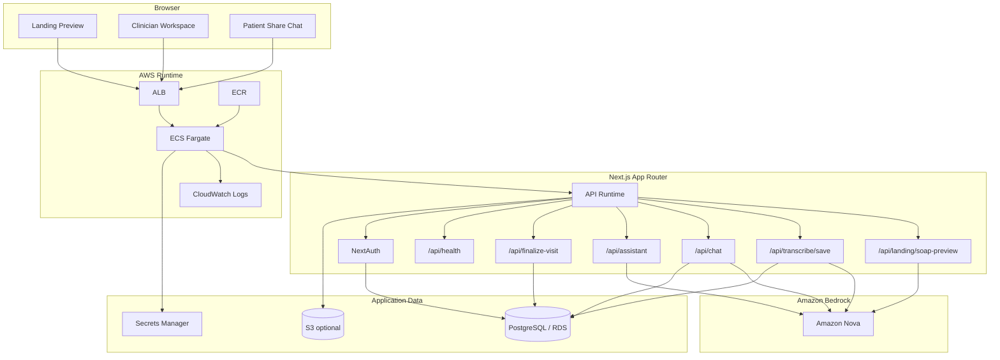
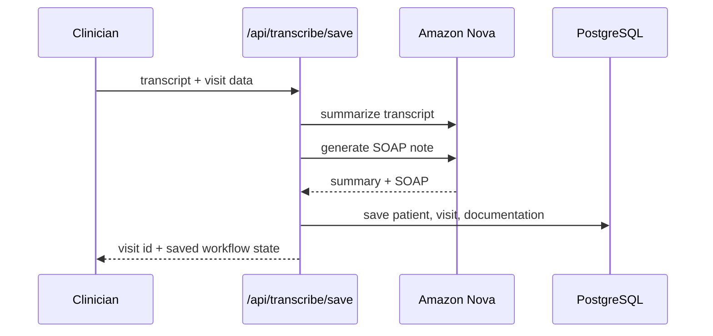
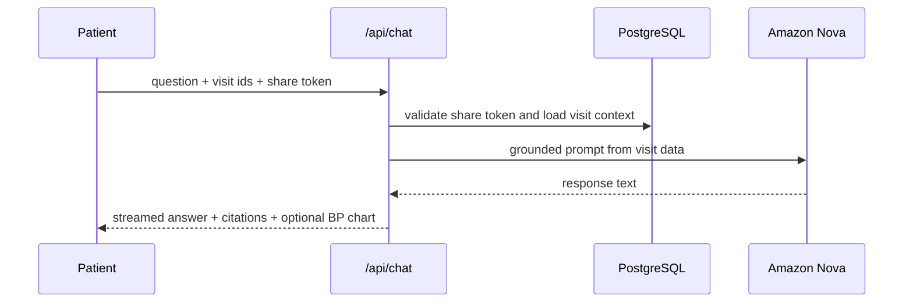

# AWS + Amazon Nova Integration Deep Dive

## Overview

This document explains how Synth uses AWS and Amazon Nova to power clinical documentation, grounded chat, and deployment infrastructure.

It covers:

- the Nova integration in code
- the runtime request flow
- the PostgreSQL + Prisma data layer
- the AWS infrastructure scaffold
- environment and deployment requirements
- current operational boundaries for the demo

Synth is designed as an AWS-native application path: Next.js on ECS, Amazon Bedrock for model inference, PostgreSQL on RDS, and Secrets Manager for runtime configuration.

## System Summary

Synth uses Amazon Nova through Amazon Bedrock for its core AI tasks:

- visit summary generation
- SOAP note generation
- grounded clinician and patient chat
- in-app assistant responses
- generated visit report content

The integration is intentionally simple:

- one shared Bedrock client wrapper
- environment-driven model selection
- deterministic fallbacks when AI generation fails
- a standard PostgreSQL application backend without external search infrastructure

## High-Level Architecture



## Where Amazon Nova Is Used

### 1. Visit summary generation

File: `src/lib/clinical-notes.ts`

`generateConversationSummary(...)` formats transcript segments into a timed doctor/patient transcript and sends a concise summarization prompt to Amazon Nova.

If Nova is unavailable, the app falls back to a deterministic summary built from transcript segments.

### 2. SOAP note generation

File: `src/lib/clinical-notes.ts`

`generateSoapNotesFromTranscript(...)` sends the transcript to Nova with a structured prompt that requests strict SOAP formatting:

- Subjective
- Objective
- Assessment
- Plan

If Nova fails, the app returns a deterministic SOAP scaffold using extracted transcript content.

### 3. Grounded clinician and patient chat

File: `src/app/api/chat/route.ts`

The chat runtime loads visit context from PostgreSQL, then builds a grounded prompt from:

- summary
- SOAP notes
- transcript
- additional notes
- appointments
- care plan items
- blood pressure history

Nova generates the response text. The route then streams the output over SSE and attaches:

- tool trace events
- citations
- source details
- blood pressure trend visualization when relevant

### 4. Landing page transcript preview

File: `src/app/api/landing/soap-preview/route.ts`

The landing page accepts transcript text or a transcript file, parses it into transcript segments, and uses Nova to generate:

- summary
- SOAP note preview

This is the fastest public-facing demo path in the app.

### 5. Assistant and report generation

Files:

- `src/app/api/assistant/route.ts`
- `src/app/api/soap-actions/[visitId]/report/route.ts`

These routes also rely on the Nova provider layer for response generation.

## Nova Provider Layer

### Core file

File: `src/lib/nova.ts`

This file is the single shared Bedrock integration point.

Responsibilities:

- initialize `BedrockRuntimeClient`
- create `ConverseCommand` requests
- normalize the Bedrock response payload into plain text
- expose high-level helper functions to the rest of the app

### Exported API

- `generateNovaText(...)`
- `generateNovaTextFromMessages(...)`
- `isNovaConfigured()`

### Request model behavior

The integration currently uses:

- `ConverseCommand` from `@aws-sdk/client-bedrock-runtime`

That gives the project one clean invocation path for both prompt-based and message-based workflows.

### Model selection

By default:

- `generateNovaText(...)` uses the fast model path
- `generateNovaTextFromMessages(...)` uses the main text model path

Model IDs are resolved from environment variables through `src/lib/config.ts`.

## Configuration Layer

File: `src/lib/config.ts`

This module centralizes AWS and model configuration:

- `AWS_REGION`
- `BEDROCK_NOVA_TEXT_MODEL_ID`
- `BEDROCK_NOVA_FAST_MODEL_ID`

It also powers readiness checks used by the app and health endpoints.

Expected defaults from `.env.example`:

- `amazon.nova-lite-v1:0`
- `amazon.nova-micro-v1:0`

## End-to-End Runtime Flows

### Transcript to saved visit



### Patient share chat



## Data Layer

### Runtime access

File: `src/lib/prisma.ts`

Synth uses native Prisma for database access. The AWS target is PostgreSQL on RDS or Aurora PostgreSQL.

### Core entities

File: `prisma/schema.prisma`

The main domain model includes:

- `User`
- `Patient`
- `Visit`
- `VisitDocumentation`
- `ShareLink`
- `Appointment`
- `CarePlanItem`
- `GeneratedReport`

This model supports the full demo story:

- capture a visit
- generate documentation
- finalize it
- share it with the patient
- answer follow-up questions from persisted records

## AWS Infrastructure Scaffold

Terraform files:

- `infra/terraform/main.tf`
- `infra/terraform/variables.tf`
- `infra/terraform/outputs.tf`
- `infra/terraform/terraform.tfvars.example`
- `infra/terraform/README.md`

### Provisioned resource set

The scaffold defines a practical hackathon deployment baseline:

- ECR repository
- ECS cluster
- ECS task definition and Fargate service
- ALB, target group, and listener
- CloudWatch log group
- RDS PostgreSQL instance
- DB subnet group
- security groups
- Secrets Manager secret
- optional S3 bucket
- IAM task execution and runtime access roles

### IAM expectations

The application runtime needs AWS permissions for:

- `bedrock:InvokeModel`
- `bedrock:InvokeModelWithResponseStream`
- reading from Secrets Manager
- optional S3 access

The Terraform scaffold includes these access paths for the ECS task role.

## Containerization

### Docker

File: `Dockerfile`

The application is prepared for container deployment with:

- a multi-stage build
- Prisma generation during install
- Next.js standalone output
- a lightweight runtime image

### Next.js output mode

File: `next.config.ts`

The app uses:

- `output: "standalone"`

This is the correct path for ECS container deployment.

## Environment Contract

Defined in `.env.example`:

```env
DATABASE_URL="postgresql://postgres:<PASSWORD>@<RDS_HOST>:5432/postgres"
DIRECT_URL="postgresql://postgres:<PASSWORD>@<RDS_HOST>:5432/postgres"

AWS_REGION=us-east-1
BEDROCK_NOVA_TEXT_MODEL_ID=amazon.nova-lite-v1:0
BEDROCK_NOVA_FAST_MODEL_ID=amazon.nova-micro-v1:0

AWS_ACCESS_KEY_ID=
AWS_SECRET_ACCESS_KEY=
S3_BUCKET_AUDIO_UPLOADS=synth-nova-audio-dev

NEXTAUTH_SECRET=...
NEXTAUTH_URL=http://localhost:3000
NEXT_PUBLIC_APP_URL=http://localhost:3000
```

### Required for local development

- PostgreSQL connection strings
- AWS region
- Bedrock model IDs
- AWS credentials with Bedrock access
- NextAuth secret

### Required for ECS runtime

At minimum, the deployed app needs:

- `DATABASE_URL`
- `DIRECT_URL`
- `NEXTAUTH_SECRET`
- `AWS_REGION`
- Nova model IDs
- public URL values for auth and app routing

For deployed AWS environments, IAM task roles are preferable to static keys.

## Bedrock and Account Requirements

Even with correct code and infrastructure, Amazon Nova calls will fail unless:

- Bedrock is enabled in the target AWS account
- the selected AWS region supports the chosen Nova models
- model access is granted in Bedrock model access settings
- the ECS task role can invoke Bedrock

## Health and Readiness

File: `src/app/api/health/route.ts`

The health endpoint is intended to quickly verify:

- database reachability
- Nova configuration presence
- general application readiness

It is also used as the ALB health check target in the Terraform scaffold.

## Demo Scope Boundaries

The current application is optimized for documentation and grounded follow-up workflows.

Important boundary:

- server-side audio transcription is not active in this build

What the product does support today:

- transcript text input
- transcript file input
- browser-assisted transcript workflow
- Nova-based summary generation
- Nova-based SOAP generation
- grounded saved-visit chat

This keeps the demo stable and focused on the core Bedrock + Nova story.

## Deployment Runbook

### 1. Install dependencies and verify locally

```bash
npm install
npm run setup
npm run lint
npx tsc --noEmit
npm run build
```

### 2. Build and push the container image

Use:

- `scripts/deploy/build-and-push.ps1`

### 3. Configure Terraform variables

Populate:

- VPC ID
- public and private subnet IDs
- app image URI
- database password
- public application URLs

### 4. Apply Terraform

From `infra/terraform/`:

```bash
terraform init
terraform plan
terraform apply
```

### 5. Add secret values

Write runtime secrets into the Secrets Manager secret used by the ECS task.

### 6. Run Prisma migrations

Recommended:

- `npx prisma migrate deploy`

This can run from a one-off ECS task or CI/CD environment with database access.

### 7. Validate the deployed app

Check:

- `/api/health`
- login flow
- landing transcript preview
- clinician save flow
- patient share chat

## Troubleshooting

### Nova configuration errors

Check:

- `AWS_REGION`
- Bedrock model IDs
- IAM permissions
- Bedrock model access in the AWS account

### Empty or fallback AI responses

Likely causes:

- Bedrock permissions missing
- Bedrock access not enabled
- wrong model or region pairing
- runtime environment values missing

### Database connection failures

Check:

- `DATABASE_URL`
- `DIRECT_URL`
- security group rules on port `5432`
- subnet routing and connectivity
- RDS instance status

### ECS app starts but AI routes fail

This usually means infrastructure is up but Bedrock access is not fully configured.

### Health check failures

Check:

- database access
- env var injection
- app port and listener configuration
- ALB target group health path

## Practical Readiness Status

Current status of the codebase:

- Bedrock integration is implemented
- Nova-backed generation paths are wired through the app
- Prisma + PostgreSQL runtime is implemented
- Docker packaging is in place
- Terraform deployment scaffold is in place

What still depends on environment setup:

- real AWS networking values
- Bedrock account access
- runtime secrets
- deployed database migrations
- public deployment configuration

## Bottom Line

Synth already has the application-level AWS and Amazon Nova integration needed for a strong hackathon deployment:

- Nova powers the core documentation and chat workflows
- AWS infrastructure is scaffolded for ECS + RDS deployment
- the runtime model is simple enough to deploy quickly

Once AWS account access, secrets, networking, and migrations are configured, the app is ready for an end-to-end demo on AWS.
