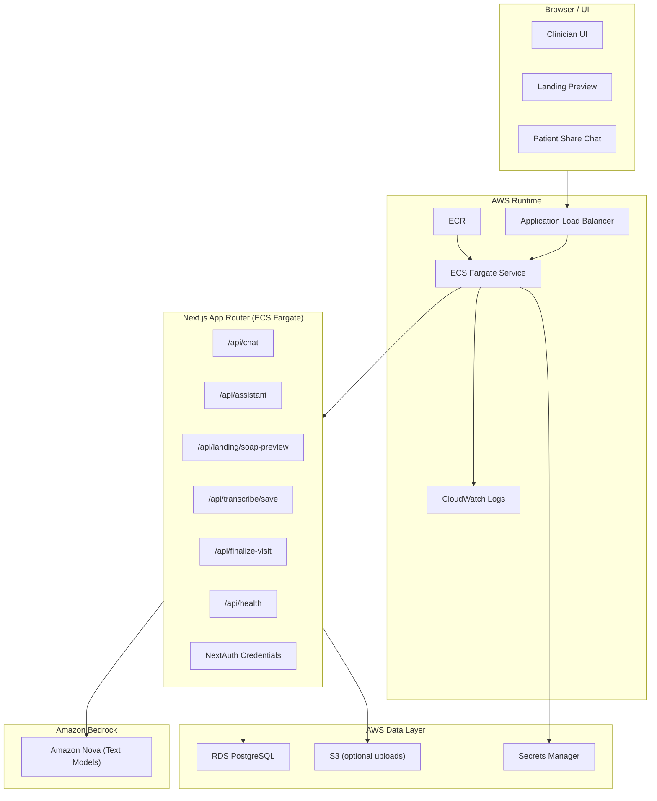
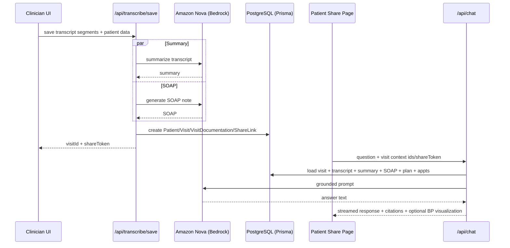

# AWS + Amazon Nova Integration Deep Dive (Synth Nova)

## Overview

This document is the AWS/Amazon Nova equivalent of the previous Elasticsearch integration deep dive.

It explains:

- what is already implemented in the codebase
- what is scaffolded for AWS but still requires deployment/configuration
- how Amazon Nova (via Bedrock) is integrated
- how the app should be deployed on AWS (production-ish hackathon setup)
- operational gaps, risks, and next steps

This reflects the current hackathon pivot state of the project.

## Executive Summary

Synth has been refocused into a Nova-first clinical workflow MVP:

- Amazon Nova (via Amazon Bedrock) now powers text generation (summary, SOAP, chat, assistant/report generation).
- Elasticsearch/Kibana runtime integrations were removed to reduce hackathon complexity.
- Supabase runtime adapter was replaced with native Prisma + PostgreSQL.
- AWS deployment scaffolding exists (Terraform + Docker + deployment script skeleton).
- The app builds successfully after dependency install and is structurally AWS-ready.

Important current limitation:

- Server-side audio transcription is intentionally disabled in this hackathon build. The intended demo path is browser live transcript and transcript-text input.

## What Is Actually AWS-Ready Right Now

### Implemented in code (ready)

- Amazon Nova provider wrapper via Bedrock Runtime in `src/lib/nova.ts`
- Shared config helpers for AWS/Nova env handling in `src/lib/config.ts`
- Core AI generation paths switched to Nova:
  - `src/lib/clinical-notes.ts`
  - `src/app/api/chat/route.ts`
  - `src/app/api/assistant/route.ts`
  - `src/app/api/soap-actions/[visitId]/report/route.ts`
- Prisma runtime client in `src/lib/prisma.ts` (native `@prisma/client`)
- DB-only finalize flow in `src/app/api/finalize-visit/route.ts`
- DB-only analytics fallback/stub in `src/app/api/analytics/route.ts`
- Health endpoint in `src/app/api/health/route.ts`
- Next.js standalone output enabled in `next.config.ts`
- Dockerfile and `.dockerignore`
- Terraform AWS deployment scaffold in `infra/terraform/*`
- Hackathon submission doc starter in `docs/HACKATHON_SUBMISSION.md`

### Scaffolded but not fully configured (manual setup required)

- Terraform infrastructure deployment values (VPC/subnets/image URI/passwords/URLs)
- Secrets Manager secret contents (`DATABASE_URL`, `DIRECT_URL`, `NEXTAUTH_SECRET`)
- ECS deployment execution
- RDS connectivity and Prisma migration run in deployed environment
- Bedrock model access permissions in your AWS account/region
- HTTPS (ACM + ALB listener 443 + optional Route53)
- CI/CD pipeline (only script scaffolding exists)

### Intentionally deferred / not implemented in this hackathon pivot

- AWS Transcribe integration (server audio transcription)
- Cognito migration (NextAuth credentials retained for speed)
- Full observability/alarms/dashboards (CloudWatch log group exists in Terraform scaffold, but no alarms/metrics pipeline yet)
- WAF, private ALB, strict IAM least privilege hardening
- Compliance posture / HIPAA controls

## Architecture (Current Hackathon Target)

### Logical Architecture

### Core Clinical Flow (Hackathon MVP)

## Code Integration Map (AWS / Nova)

### Amazon Nova Provider Layer

`src/lib/nova.ts`

Responsibilities:

- Initializes `BedrockRuntimeClient`
- Uses `ConverseCommand` for text generation
- Exposes:
  - `generateNovaText(...)`
  - `generateNovaTextFromMessages(...)`
  - `isNovaConfigured()`

Key behavior:

- Reads region/model IDs from `src/lib/config.ts`
- Throws explicit errors if AWS/Nova env config is missing
- Normalizes Bedrock response payload into plain text

### Shared Config / Env Resolution

`src/lib/config.ts`

Responsibilities:

- reads `AWS_REGION`
- resolves Nova model IDs:
  - `BEDROCK_NOVA_TEXT_MODEL_ID`
  - `BEDROCK_NOVA_FAST_MODEL_ID`
- exposes app version and Nova configuration checks

### Provider Cleanup

Legacy compatibility code has been removed so the Nova integration path is now direct:

- `src/lib/nova.ts` is the only active model provider wrapper
- audio-style requests remain intentionally unsupported in this hackathon build

### Clinical Generation

`src/lib/clinical-notes.ts`

Nova-powered functions:

- `generateConversationSummary(...)`
- `generateSoapNotesFromTranscript(...)`

Fallbacks preserved:

- deterministic summary and SOAP generators if Nova fails or is unavailable

### Chat Runtime (Patient / Clinician)

`src/app/api/chat/route.ts`

Changes vs old architecture:

- Kibana Agent Builder branch removed
- Elasticsearch dependency removed
- Nova is now the primary generation backend
- Existing streaming SSE behavior preserved
- Existing citation extraction and BP trend visualization logic preserved

### Assistant / Report Generation

Nova-backed:

- `src/app/api/assistant/route.ts`
- `src/app/api/soap-actions/[visitId]/report/route.ts`

### Finalization / Analytics (No Elastic)

`src/app/api/finalize-visit/route.ts`

- Generates local entity extraction using `src/lib/clinical-entities.ts`
- Finalizes visit in DB
- Creates share link
- Returns artifacts without indexing to Elasticsearch

`src/app/api/analytics/route.ts`

- Returns DB-only summary payload (lightweight)
- Explicitly indicates Elastic analytics are disabled in hackathon build

## Database Layer (AWS Postgres + Prisma)

### Runtime DB Access

`src/lib/prisma.ts`

Current state:

- Uses native `PrismaClient`
- Supabase runtime adapter removed

This is the intended AWS deployment runtime path for:

- RDS PostgreSQL
- Aurora PostgreSQL (if you swap target)

### Prisma Schema

`prisma/schema.prisma`

Core entities still power the product:

- `User`
- `Patient`
- `Visit`
- `VisitDocumentation`
- `ShareLink`
- `Appointment`
- `CarePlanItem`
- `GeneratedReport`

No schema redesign was required for the AWS pivot.

## AWS Infrastructure Scaffold (Terraform)

### Files

- `infra/terraform/main.tf`
- `infra/terraform/variables.tf`
- `infra/terraform/outputs.tf`
- `infra/terraform/terraform.tfvars.example`
- `infra/terraform/README.md`

### Provisioned Resources (Scaffold)

`infra/terraform/main.tf` currently defines a production-ish baseline:

- `aws_ecr_repository` (container image storage)
- `aws_s3_bucket` + public access block (optional uploads/artifacts)
- `aws_cloudwatch_log_group` (app logs)
- `aws_db_subnet_group`
- `aws_security_group` (app + db)
- `aws_db_instance` PostgreSQL (RDS)
- `aws_secretsmanager_secret` (app environment secret container)
- `aws_ecs_cluster`
- ECS task execution role + task role
- IAM policy for:
  - Bedrock invoke
  - Secrets Manager read
  - S3 access
- `aws_lb` (ALB)
- `aws_lb_target_group` (health check: `/api/health`)
- `aws_lb_listener` (HTTP/80)
- `aws_ecs_task_definition`
- `aws_ecs_service` (Fargate)

### What Terraform Does NOT Fully Handle Yet (by design)

- Writing secret values into the Secrets Manager secret
- HTTPS listener / ACM certificate
- Route53 DNS
- RDS migration execution (Prisma migrate)
- Autoscaling policies
- CloudWatch alarms
- WAF

## Containerization and Build

### Docker

`Dockerfile`

Key points:

- Multi-stage build
- `prisma/` copied before `npm install` because `postinstall` runs `prisma generate`
- Uses Next standalone output
- Final runtime starts `server.js`

### Standalone Output

`next.config.ts`

- `output: 'standalone'` enabled for container deployment

### Windows Build Note

On Windows, Next standalone copy can emit a traced-file copy warning involving `:` in a filename. Build may still succeed and exit `0`.

This is a platform/path quirk, not an application logic failure.

## Environment Variables (AWS/Nova Build)

### Required (App + AWS/Nova)

Defined in `.env.example`:

- `DATABASE_URL`
- `DIRECT_URL`
- `AWS_REGION`
- `BEDROCK_NOVA_TEXT_MODEL_ID`
- `BEDROCK_NOVA_FAST_MODEL_ID`
- `NEXTAUTH_SECRET`
- `NEXTAUTH_URL`
- `NEXT_PUBLIC_APP_URL`

### Optional / Future Use

- `AWS_ACCESS_KEY_ID` (local dev only)
- `AWS_SECRET_ACCESS_KEY` (local dev only)
- `S3_BUCKET_AUDIO_UPLOADS`

### Runtime Secret Contract for ECS

Terraform task definition expects the Secrets Manager secret to contain:

- `DATABASE_URL`
- `DIRECT_URL`
- `NEXTAUTH_SECRET`

The ECS task definition reads these via `secrets` entries.

## Amazon Nova (Bedrock) Integration Details

### Invocation Pattern

Current implementation uses Bedrock `ConverseCommand`.

Why this is good for the hackathon:

- Clean chat-style API shape
- Easy to swap Nova model IDs by env var
- Good fit for summarization/structured text generation tasks

### Model IDs

Defaults in code (`src/lib/config.ts`):

- text/default: `amazon.nova-lite-v1:0`
- fast/default: `amazon.nova-micro-v1:0`

You can override by env without code changes.

### IAM Requirements

ECS task role must be allowed to call:

- `bedrock:InvokeModel`
- `bedrock:InvokeModelWithResponseStream`

Terraform scaffold includes this (`aws_iam_role_policy.bedrock_access`).

### Account / Region Requirements

Even if code is correct, Bedrock will fail unless:

- Bedrock is enabled in your AWS account
- the selected region supports the chosen Nova model IDs
- model access is granted in Bedrock model access settings

## Security Model (Current Hackathon Build)

### App-level security (implemented)

- NextAuth credential auth for clinician routes
- Share-token validation for patient routes
- Ownership checks in chat and visit APIs
- Secrets intended to come from AWS Secrets Manager (ECS)

### Infra-level security (scaffolded)

- App and DB security groups
- Private subnets for ECS/RDS (expected input)
- Private RDS (`publicly_accessible = false`)
- S3 public access blocked

### Not yet hardened (post-hackathon)

- HTTPS/ACM listener on ALB
- WAF
- KMS CMKs for explicit encryption control
- Secrets rotation
- least-privilege Bedrock resource ARNs
- audit/event trail for regulated environments

## Operational Runbook (Deployment)

### 1) Build and push image

Use:

- `scripts/deploy/build-and-push.ps1`

Inputs required:

- image tag
- AWS region
- ECR repository URI

### 2) Configure Terraform

Copy:

- `infra/terraform/terraform.tfvars.example` -> `infra/terraform/terraform.tfvars`

Fill:

- `vpc_id`
- `public_subnet_ids`
- `private_subnet_ids`
- `app_image_uri`
- `db_password`
- `nextauth_url`
- `next_public_app_url`

### 3) Apply Terraform

From `infra/terraform/`:

- `terraform init`
- `terraform plan`
- `terraform apply`

### 4) Populate Secrets Manager secret

After apply, write values to the secret output by Terraform:

- `DATABASE_URL`
- `DIRECT_URL`
- `NEXTAUTH_SECRET`

### 5) Run Prisma migrations

Recommended approaches:

- one-off ECS task using the same image (`npx prisma migrate deploy`)
- CI/CD job with network access to RDS

### 6) Force ECS service deployment

After secrets/migrations are ready:

- update service / force new deployment

### 7) Validate

- `GET /api/health`
- login flow
- transcript save -> SOAP generation
- patient share chat

## Troubleshooting (AWS / Nova)

### Bedrock module import/build failure

Symptoms:

- `Can't resolve '@aws-sdk/client-bedrock-runtime'`

Fix:

- run `npm install` (updates `node_modules` and `package-lock.json`)

### Nova not configured at runtime

Symptoms:

- AI routes return configuration error

Check:

- `AWS_REGION`
- model ID env vars
- ECS task role permissions
- Bedrock model access enabled in AWS account

### Chat/summary/report fallbacks triggered

Symptoms:

- deterministic fallback text appears

Causes:

- Bedrock permission failure
- model access denied
- region mismatch
- malformed secret/env config

### RDS connection failure

Check:

- `DATABASE_URL` / `DIRECT_URL`
- SG rules (app SG -> DB SG on 5432)
- subnet routing / NAT for ECS (if needed)
- RDS instance status

### `/api/health` reports `novaConfigured=false`

Cause:

- `AWS_REGION` missing in runtime env

## Gaps and Recommended Next Steps

### High priority (complete before demo)

1. Deploy Terraform scaffold with real VPC/subnets
2. Populate Secrets Manager secret values
3. Run Prisma migrations on deployed DB
4. Confirm Bedrock model access + permissions
5. Test end-to-end demo on AWS URL

### Medium priority (stronger demo)

1. Add HTTPS (ACM + ALB 443 listener + redirect 80->443)
2. Add CloudWatch alarms (5xx, CPU/memory)
3. Add GitHub Actions deploy workflow

### Optional (post-hackathon)

1. Integrate AWS Transcribe for server audio transcription
2. Replace NextAuth credentials with Cognito
3. Add S3 upload pipeline for audio files
4. Add richer analytics (Athena/OpenSearch/warehouse path)

## Verification Status (Current)

Validated after the AWS/Nova pivot:

- TypeScript typecheck passes
- ESLint passes
- Production build passes (with Windows standalone traced-file warning noted)

This means the codebase is in a deployable shape once AWS account resources and runtime secrets are configured.

## Quick Readiness Answer (Short Version)

Is everything else AWS-ready?

- Code architecture: mostly yes
- Infra scaffold: yes
- Turnkey deployment: no (manual AWS configuration and deployment steps still required)
- Audio transcription on server: no (intentionally disabled for this hackathon build)
