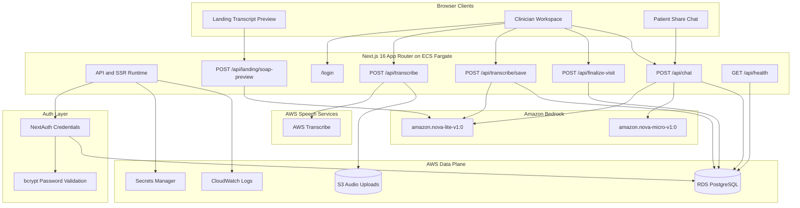
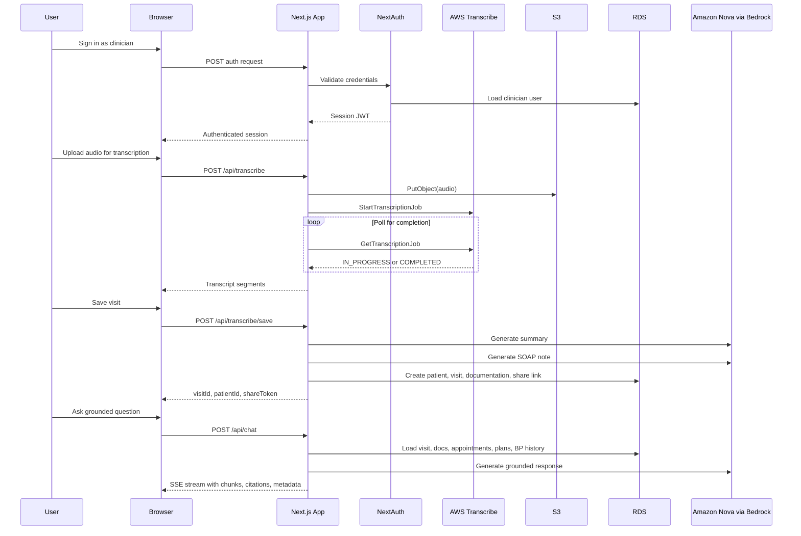
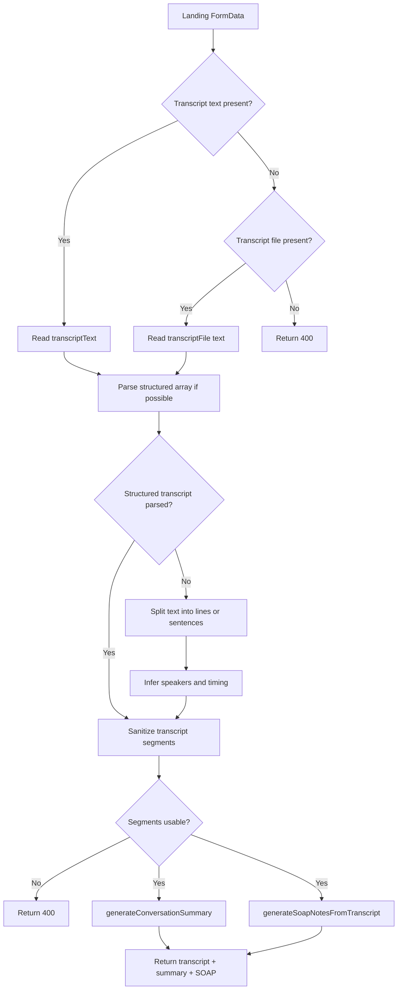
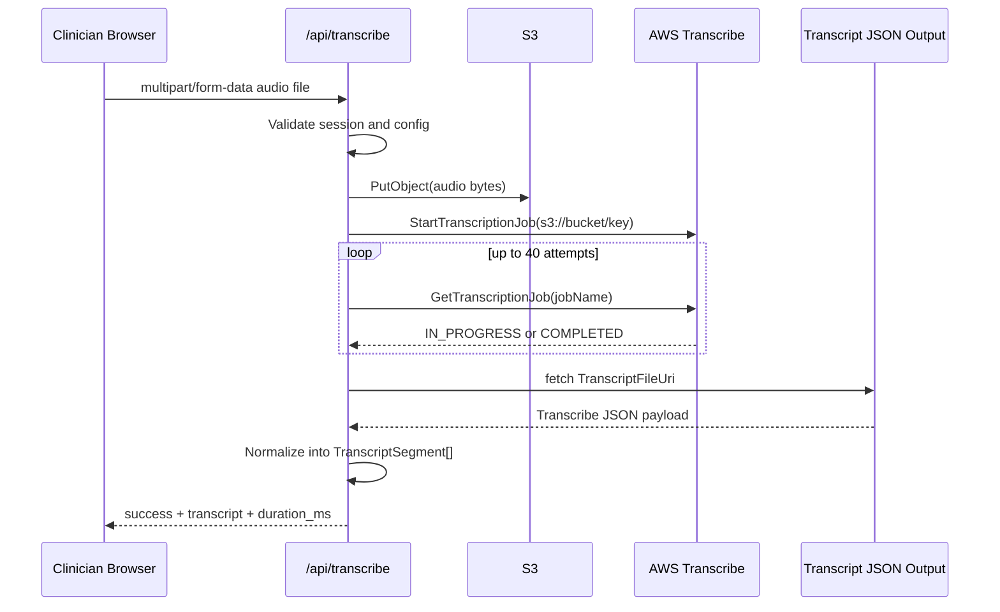
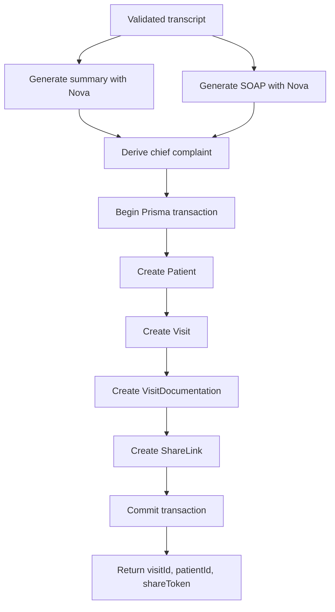
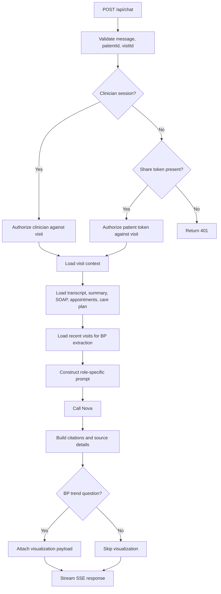
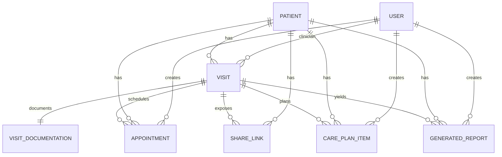
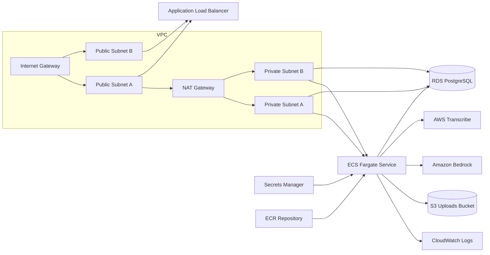

# AWS Amazon Nova Integration Deep Dive

This document is the technical architecture note for Synth as currently implemented in this repository. It is intentionally detailed. The goal is to explain the actual runtime model, control flow, data model, AWS boundary, failure behavior, and deployment contract behind the application.

Synth is a clinical workflow application built around four core capabilities:

- transcript-to-summary generation
- transcript-to-SOAP note generation
- grounded clinician and patient chat
- audio transcription with AWS Transcribe feeding the Nova-powered documentation pipeline

The implementation is AWS-native at the inference, storage, deployment, and operations layers:

- Amazon Bedrock hosts the Amazon Nova models
- AWS Transcribe handles server-side audio transcription
- Amazon S3 stores uploaded transcription media
- Amazon ECS Fargate runs the Next.js application container
- Amazon RDS PostgreSQL stores application and visit data
- AWS Secrets Manager provides runtime secret material
- Amazon CloudWatch stores application logs
- Amazon ECR stores the application container image
- Application Load Balancer exposes the public HTTP entry point

The current authentication model is intentionally simple and reliable for the hackathon path:

- NextAuth credentials provider
- Prisma-backed clinician user records
- bcrypt password hashes stored in PostgreSQL
- JWT session strategy

## System Goals

The system is designed to optimize for:

- low-friction clinical demo flows
- strong Bedrock and Nova usage as the central AI layer
- deterministic data persistence around generated clinical artifacts
- grounded patient follow-up instead of generic chatbot behavior
- deployability on AWS without needing pre-existing networking

It is not currently optimized for:

- full EHR interoperability
- multi-tenant production hardening
- HIPAA certification posture
- long-running asynchronous orchestration services
- event-driven transcript job processing with queue workers

This distinction matters because several parts of the system intentionally favor directness over distributed complexity. That is a reasonable tradeoff for a hackathon-grade system that still needs a coherent production-path architecture.

## Repository Map

The most relevant implementation files for this document are:

- [`src/lib/nova.ts`](C:/Users/manoj/CascadeProjects/Synth/src/lib/nova.ts)
- [`src/lib/clinical-notes.ts`](C:/Users/manoj/CascadeProjects/Synth/src/lib/clinical-notes.ts)
- [`src/lib/transcribe.ts`](C:/Users/manoj/CascadeProjects/Synth/src/lib/transcribe.ts)
- [`src/lib/auth.ts`](C:/Users/manoj/CascadeProjects/Synth/src/lib/auth.ts)
- [`src/lib/config.ts`](C:/Users/manoj/CascadeProjects/Synth/src/lib/config.ts)
- [`src/app/api/landing/soap-preview/route.ts`](C:/Users/manoj/CascadeProjects/Synth/src/app/api/landing/soap-preview/route.ts)
- [`src/app/api/transcribe/route.ts`](C:/Users/manoj/CascadeProjects/Synth/src/app/api/transcribe/route.ts)
- [`src/app/api/transcribe/save/route.ts`](C:/Users/manoj/CascadeProjects/Synth/src/app/api/transcribe/save/route.ts)
- [`src/app/api/finalize-visit/route.ts`](C:/Users/manoj/CascadeProjects/Synth/src/app/api/finalize-visit/route.ts)
- [`src/app/api/chat/route.ts`](C:/Users/manoj/CascadeProjects/Synth/src/app/api/chat/route.ts)
- [`src/app/api/health/route.ts`](C:/Users/manoj/CascadeProjects/Synth/src/app/api/health/route.ts)
- [`prisma/schema.prisma`](C:/Users/manoj/CascadeProjects/Synth/prisma/schema.prisma)
- [`infra/terraform/main.tf`](C:/Users/manoj/CascadeProjects/Synth/infra/terraform/main.tf)
- [`infra/terraform/variables.tf`](C:/Users/manoj/CascadeProjects/Synth/infra/terraform/variables.tf)
- [`infra/terraform/outputs.tf`](C:/Users/manoj/CascadeProjects/Synth/infra/terraform/outputs.tf)

## High-Level Architecture



## Request and Data Flow Overview

At a high level, the system has three distinct operational modes:

1. public preview mode
2. authenticated clinician mode
3. patient share-link mode

These modes share the same Bedrock/Nova infrastructure, but they differ materially in:

- input source
- authorization model
- persistence behavior
- retrieval grounding strategy

### Public preview mode

The public landing page is a non-authenticated demonstration path. It accepts transcript text or transcript text files, parses them into normalized transcript segments, and then runs two Bedrock calls:

- summary generation
- SOAP note generation

This route does not persist data to PostgreSQL.

### Clinician mode

The clinician mode is authenticated, persists data, and supports both transcript text workflows and server-side audio transcription workflows.

The core lifecycle is:

1. clinician signs in
2. clinician records or uploads audio, or works from transcript content
3. server optionally transcribes audio via AWS Transcribe
4. transcript segments are normalized
5. summary and SOAP are generated via Amazon Nova
6. patient, visit, documentation, and share-link artifacts are stored in PostgreSQL
7. clinician can finalize the visit and use grounded follow-up chat

### Patient share-link mode

The patient mode is not authenticated with an account. Instead, access is granted through a share token tied to a persisted visit and patient combination.

The patient cannot see arbitrary app data. The patient chat route validates:

- token validity
- token revocation state
- token expiration
- token-to-patient match
- token-to-visit match

Only after those checks does the route construct grounded context and call Nova.

## End-to-End Runtime Sequence



## Authentication and Session Model

The current auth stack is intentionally conservative.

There is exactly one active provider:

- NextAuth credentials provider

The implementation lives in [`src/lib/auth.ts`](C:/Users/manoj/CascadeProjects/Synth/src/lib/auth.ts).

### Why credentials-only

The project previously explored external identity-provider integration, but the current runtime path deliberately keeps auth inside the application boundary. This simplifies:

- demo account creation
- clinician onboarding
- AWS deployment configuration
- local development parity
- hackathon review flows

This also means the full identity path is application-owned:

- user lookup via Prisma
- password comparison via bcrypt
- session token issuance via NextAuth JWT strategy

### Credentials authorize flow

The provider accepts:

- `email`
- `password`
- `name`
- `intent`

`intent` is used to support both:

- sign-in
- sign-up

If `intent === "signup"`:

- the code checks whether the email already exists
- hashes the password with bcrypt cost `10`
- creates a clinician user row
- attempts to create a demo SOAP note fixture for the new clinician

If `intent !== "signup"`:

- the code looks up the existing user by normalized email
- verifies `passwordHash`
- compares the submitted password against the bcrypt hash

### JWT session strategy

The NextAuth session model uses JWT rather than database-backed sessions. The important implications are:

- low operational overhead
- no session-table dependency
- session payload enriched from Prisma during callbacks

The `jwt` callback:

- stores `userId`
- stores `role`
- stores `authProvider`
- rehydrates missing identity metadata from Prisma if needed

The `session` callback:

- loads the current clinician profile from Prisma
- attaches application-level profile fields to `session.user`
- exposes `practiceName`, `specialty`, and onboarding state

### Auth authorization boundaries

Clinician-only routes depend on one of two server checks:

- direct session validation in the route handler
- `requireClinicianPage()` from the server auth helper path

The clinician guard conceptually requires:

- valid session
- `role === "clinician"`
- valid user row in PostgreSQL

Patient access is not user-account auth. It is token-gated resource access.

## Bedrock and Amazon Nova Integration

The Nova integration is centralized in [`src/lib/nova.ts`](C:/Users/manoj/CascadeProjects/Synth/src/lib/nova.ts).

This file is intentionally small. That is a good design choice. It keeps all Bedrock invocation logic in one place and lets the application routes think in terms of `generateNovaText()` instead of SDK primitives.

### Bedrock client lifecycle

The module memoizes a `BedrockRuntimeClient` instance:

- first call creates the client
- subsequent calls reuse the same client object

This is useful in the server runtime because it avoids repeatedly constructing SDK clients on each request.

### API surface

The module exposes two public generation functions:

- `generateNovaText()`
- `generateNovaTextFromMessages()`

`generateNovaText()` is the simpler one-shot prompt interface.

`generateNovaTextFromMessages()` supports structured multi-message invocation and defaults to the larger text model path.

### Underlying Bedrock operation

The implementation uses the Bedrock `ConverseCommand`.

That is important because the app is not using raw provider-native JSON request bodies. It is using the Bedrock unified converse abstraction. This has several advantages:

- simpler model switching
- cleaner message-role handling
- less provider-specific request shaping code

### Model selection strategy

Environment variables:

```env
AWS_REGION=us-east-1
BEDROCK_NOVA_TEXT_MODEL_ID=amazon.nova-lite-v1:0
BEDROCK_NOVA_FAST_MODEL_ID=amazon.nova-micro-v1:0
```

The current code path defaults to:

- `amazon.nova-micro-v1:0` for `generateNovaText()`
- `amazon.nova-lite-v1:0` for the more structured messages API

In practice this means the app biases toward:

- lower latency for straightforward generation tasks
- a stronger text model when a richer structured conversation entry point is used

That balance is reasonable because the app makes many direct text-generation calls and benefits from predictable response latency.

### Response normalization

The Nova wrapper extracts text from:

- `response.output.message.content[]`

It concatenates all text fragments, trims whitespace, and throws if the model returns no text. This is a good defensive behavior because it forces callers into explicit error handling rather than silently propagating empty AI output.

## Clinical Prompting Layer

The application-specific prompt engineering lives mainly in [`src/lib/clinical-notes.ts`](C:/Users/manoj/CascadeProjects/Synth/src/lib/clinical-notes.ts).

This module does three important things:

- defines the normalized transcript shape
- formats transcripts for Nova prompts
- exposes domain-specific generation helpers

### Transcript segment model

The transcript abstraction is:

```ts
type TranscriptSegment = {
  speaker: 'clinician' | 'patient'
  start_ms: number
  end_ms: number
  text: string
}
```

This shape is small but strong. It preserves:

- role separation
- sequence
- approximate timing
- compatibility with both manual and machine transcription inputs

That same structure is reused across:

- landing-page preview parsing
- AWS Transcribe outputs
- persisted visit transcript JSON
- chat transcript reconstruction

### Transcript formatting strategy

Before sending a transcript to Nova, the app converts each segment into:

```text
[mm:ss] Doctor: ...
[mm:ss] Patient: ...
```

This formatting is important for three reasons:

1. it gives Nova clear speaker identity
2. it provides chronology
3. it creates a citation-like structure that can later be echoed back in grounded responses

### Summary generation prompt

`generateConversationSummary()` sends a focused summarization instruction:

- 3 to 5 concise bullet points
- focus on chief complaint
- focus on key findings
- focus on decisions
- focus on next steps

The generation parameters are tuned for consistency:

- `maxTokens: 600`
- `temperature: 0.2`

This is appropriate for documentation generation because low-temperature output reduces stylistic drift.

### SOAP note generation prompt

`generateSoapNotesFromTranscript()` uses a stricter structured prompt with explicit required headings:

- `# SOAP Note`
- `## S (Subjective)`
- `## O (Objective)`
- `## A (Assessment)`
- `## P (Plan)`

The prompt also instructs Nova to:

- extract real information from transcript content
- stay concise
- mark uncertain items as `[to be confirmed]`

This matters because clinical documentation quality depends heavily on structural consistency.

### Deterministic fallback behavior

This module does not fully fail closed when Nova is unavailable.

If a Nova request throws:

- summary generation falls back to a handcrafted conversation summary
- SOAP generation falls back to a templated SOAP draft

That is a strong product decision for a demo system because it prevents the app from becoming unusable when the model is unavailable.

## Landing Preview Pipeline

The landing-page preview flow is implemented in [`src/app/api/landing/soap-preview/route.ts`](C:/Users/manoj/CascadeProjects/Synth/src/app/api/landing/soap-preview/route.ts).

This route is interesting because it is effectively a public mini-ingestion pipeline with its own parsing and normalization layer.

### Inputs

The route accepts `multipart/form-data` with:

- `mode`
- `transcriptText`
- `transcriptFile`

Audio mode is intentionally disabled for the public landing preview. That is a deliberate scope boundary.

### Parsing strategy

The route tries transcript parsing in several passes:

1. parse structured transcript arrays if JSON-like content is embedded
2. split by lines if multiple transcript lines are present
3. split by sentence boundaries if the input is a single large blob
4. infer speaker from explicit prefixes like `Doctor:` or `Patient:`
5. infer speaker heuristically from content if no explicit prefix exists

### Speaker inference heuristics

The route contains a clinician-hints vs patient-hints scoring system.

Examples of clinician hints:

- `i recommend`
- `we should`
- `follow up`
- `prescribe`

Examples of patient hints:

- `i feel`
- `my pain`
- `my symptoms`
- `i noticed`

If hints tie, the parser alternates relative to the previous speaker. This is imperfect, but it is pragmatic and keeps the public preview useful even for poorly formatted transcripts.

### Sanitization

The route also corrects:

- empty text segments
- invalid timestamps
- missing duration ranges
- inconsistent speaker labels

The sanitized result is a proper `TranscriptSegment[]`, which is then passed to the summary and SOAP generators in parallel.

### Landing preview flowchart



## AWS Transcribe Pipeline

The server-side audio transcription system is implemented in [`src/lib/transcribe.ts`](C:/Users/manoj/CascadeProjects/Synth/src/lib/transcribe.ts) and exposed through [`src/app/api/transcribe/route.ts`](C:/Users/manoj/CascadeProjects/Synth/src/app/api/transcribe/route.ts).

### Route contract

`POST /api/transcribe` requires:

- authenticated session
- Nova configured
- Transcribe configured
- `audio` file in `multipart/form-data`

The route explicitly refuses to proceed if:

- there is no authenticated session
- `AWS_REGION` is missing
- Bedrock model env vars are missing
- `S3_BUCKET_AUDIO_UPLOADS` is missing
- the audio file was not provided

This route is a good example of explicit runtime validation before expensive downstream calls.

### Audio upload strategy

The transcribe helper:

1. detects file extension from filename or MIME type
2. normalizes to one of the supported formats
3. uploads the raw audio bytes to S3
4. starts an AWS Transcribe job pointing at the S3 URI
5. polls the job status
6. fetches the output transcript JSON from the URI returned by Transcribe
7. converts that payload into the app’s internal `TranscriptSegment[]`

### Supported audio formats

The code currently recognizes:

- `mp3`
- `mp4`
- `wav`
- `flac`
- `ogg`
- `amr`
- `webm`
- `m4a`

### Speaker diarization strategy

The Transcribe job requests:

- `ShowSpeakerLabels: true`
- `MaxSpeakerLabels: 2`

That is a key product assumption:

- one clinician
- one patient

The parser then maps speaker labels into application roles:

- first label encountered -> `patient`
- second label encountered -> `clinician`
- any additional labels alternate by position parity

This is a heuristic, not a semantically guaranteed role mapping. It works acceptably for two-speaker office-visit audio, but it is not a general diarization truth engine.

### Transcript normalization behavior

The parser reconstructs segments from:

- pronunciation items
- punctuation items
- speaker label ranges

It merges adjacent tokens into segments when:

- speaker is unchanged
- there is no major timing gap

If AWS Transcribe returns insufficient structure, the code falls back to sentence-based reconstruction from the raw transcript text.

### Polling behavior

The current implementation uses in-request polling:

- up to 40 attempts
- 3 seconds between attempts

This means the maximum wait is roughly two minutes.

That is acceptable for a hackathon implementation, but it has clear production implications:

- long-running request occupancy
- client waiting on a single HTTP response
- no asynchronous job callback model

A future production evolution would likely move this to:

- upload request
- async job start
- persisted job record
- background completion handler
- client polling a status endpoint

### Transcribe sequence



## Save Pipeline

The visit save pipeline is implemented in [`src/app/api/transcribe/save/route.ts`](C:/Users/manoj/CascadeProjects/Synth/src/app/api/transcribe/save/route.ts).

This route is the main persistence boundary between transient transcript work and permanent visit records.

### Inputs

The route expects JSON containing:

- `patientName`
- `transcript`

The transcript must already be in normalized internal segment shape.

### Validation

The route validates:

- clinician session
- non-empty patient name
- transcript array presence
- transcript element structure and types

This route does not trust the incoming transcript blindly. It revalidates every segment.

### Generation and persistence order

The route does the following:

1. validates transcript
2. generates summary
3. generates SOAP
4. derives chief complaint
5. opens a Prisma transaction
6. creates patient row
7. creates visit row
8. creates visit documentation row
9. creates share-link row
10. returns identifiers and share token

### Important design property

The data write is transactional after AI generation.

That means:

- Nova calls occur before the database transaction
- the transaction contains only persistence work

This is the correct shape. It avoids holding a database transaction open while waiting on AI inference latency.

### Save transaction diagram



## Finalize Visit Pipeline

The finalize route lives in [`src/app/api/finalize-visit/route.ts`](C:/Users/manoj/CascadeProjects/Synth/src/app/api/finalize-visit/route.ts).

This route is different from the save route.

It is not primarily a Nova route. It is a post-processing route that:

- loads persisted transcript JSON
- extracts lightweight medical entities
- derives after-visit artifacts
- finalizes visit state
- ensures a share token exists

### Entity extraction

Each transcript chunk is passed through `extractMedicalEntities()`.

The route then aggregates:

- medications
- symptoms
- procedures
- vitals

It produces:

- a generated after-visit summary
- a draft SOAP note
- follow-up task extraction

### Why this route exists

The save route is optimized for immediate documentation generation.

The finalize route is optimized for:

- artifact refinement
- chunk-wise entity extraction
- post-visit structured outputs
- patient share-link readiness

### Current artifact quality note

This route’s generated outputs are more deterministic and rule-based than the Nova-generated clinical summary/SOAP pipeline. That is an intentional implementation distinction:

- save route: AI-first clinical generation
- finalize route: extraction-first post-processing

That layering is useful because it separates core doc generation from additional artifact shaping.

## Grounded Chat Pipeline

The grounded chat implementation in [`src/app/api/chat/route.ts`](C:/Users/manoj/CascadeProjects/Synth/src/app/api/chat/route.ts) is one of the strongest technical parts of the system.

It is not a generic chatbot wrapper. It performs:

- access resolution
- database retrieval
- transcript reconstruction
- blood pressure extraction across visits
- prompt grounding
- streaming response delivery
- citation and visualization packaging

### Authorization model

The route supports two access roles:

- `clinician`
- `patient`

Clinician access requires:

- authenticated session
- visit exists
- visit belongs to clinician
- patient ID matches

Patient access requires:

- share token provided
- share link exists
- link is not revoked
- link is not expired
- patient ID matches
- visit ID matches

### Context loading

The route loads:

- visit
- patient
- visit documentation
- appointments
- care plan items
- up to 10 recent patient visits for blood pressure history extraction

The context is assembled into a `VisitContext` object that includes:

- `patientName`
- `transcriptText`
- `summary`
- `soapNotes`
- `additionalNotes`
- `appointments`
- `planItems`
- `bpHistory`

### Transcript reconstruction

Persisted transcript JSON is converted back to text in this format:

```text
[mm:ss] Doctor: ...
[mm:ss] Patient: ...
```

That text form is then used in the grounded prompt.

### Blood pressure extraction logic

The route extracts blood pressure from three possible sources, in descending preference:

- SOAP
- summary
- transcript

It uses regexes for:

- labeled blood pressure references
- generic `systolic/diastolic` forms

The code validates readings against plausible physiological ranges before accepting them.

This is a very good detail. It prevents obviously invalid numeric pairs from being plotted or cited as vitals.

### Visualization logic

If the user asks a blood-pressure comparison or trend question, and enough history exists, the route produces a visualization payload:

- `type: "bp_trend"`
- title
- description
- chart-ready data array

The frontend later turns this into a Recharts line chart.

### Prompt construction

The route builds separate system prompts for:

- clinician
- patient

The patient prompt is stricter and more safety-oriented:

- use simple language
- avoid inventing prescriptions
- prefer documented data
- allow cautious general education if the chart does not answer directly
- explicitly ground blood pressure history answers in retrieved visit context

### Failure fallback

If Nova generation fails, the route does not crash the experience. It falls back to deterministic handlers for:

- blood pressure comparisons
- appointment lookup
- care plan task lookup
- generic degraded-mode messaging

This is an important reliability choice because chat remains partially functional even when inference is unavailable.

### Chat pipeline flowchart



### Streaming strategy

The route returns `text/event-stream`.

It emits:

- `conversation_id_set`
- `tool_call`
- `tool_result`
- `message_chunk`
- `message_metadata`
- `message_complete`

This is not Bedrock-native streaming. The route simulates streaming by chunking the final response text word-by-word. That is still useful from a UX standpoint because:

- the frontend gets incremental rendering
- tool events can be displayed before the final response completes
- metadata can be sent separately from the text stream

## Data Model

The Prisma schema is defined in [`prisma/schema.prisma`](C:/Users/manoj/CascadeProjects/Synth/prisma/schema.prisma).

### Core tables

`User`

- clinician identity
- role
- optional profile metadata
- hashed password

`Patient`

- display name
- optional date of birth

`Visit`

- ties patient to clinician
- status
- chief complaint
- start and finalize timestamps

`VisitDocumentation`

- one-to-one with visit
- transcript JSON
- summary
- SOAP note
- additional notes

`ShareLink`

- tokenized patient access handle
- expiration and revocation support

`Appointment`

- visit-linked future scheduling artifact

`CarePlanItem`

- visit-linked tasking artifact

`GeneratedReport`

- generated report content tied to visit, patient, and clinician

### Relational shape



### Why transcript JSON is stored as a string

`VisitDocumentation.transcriptJson` is a string column containing serialized transcript segments.

That choice is pragmatic:

- easy to persist from Node without additional table fanout
- easy to reconstruct into transcript text
- compatible with both browser and Transcribe-produced transcripts

The tradeoff is queryability. If transcript segment analytics become important, a future evolution would normalize transcript chunks into their own table.

## Configuration Model

Runtime configuration lives in [`src/lib/config.ts`](C:/Users/manoj/CascadeProjects/Synth/src/lib/config.ts).

### Key environment variables

```env
DATABASE_URL=postgresql://...
DIRECT_URL=postgresql://...
AWS_REGION=us-east-1
BEDROCK_NOVA_TEXT_MODEL_ID=amazon.nova-lite-v1:0
BEDROCK_NOVA_FAST_MODEL_ID=amazon.nova-micro-v1:0
TRANSCRIBE_LANGUAGE_CODE=en-US
S3_BUCKET_AUDIO_UPLOADS=synth-nova-audio-dev
NEXTAUTH_SECRET=<secret>
NEXTAUTH_URL=http://localhost:3000
NEXT_PUBLIC_APP_URL=http://localhost:3000
```

### Derived capability checks

The config layer exposes boolean capability functions such as:

- `isNovaConfigured()`
- `isAwsTranscribeConfigured()`
- `isAuthConfigured()`
- `isPublicUrlConfigured()`
- `isUploadsBucketConfigured()`

This is a simple but effective pattern. Route handlers can fail fast with meaningful messages before hitting downstream services.

## Health Check Model

The health route at [`src/app/api/health/route.ts`](C:/Users/manoj/CascadeProjects/Synth/src/app/api/health/route.ts) validates:

- database environment presence
- live database reachability
- Nova configuration presence
- auth configuration presence
- public URL configuration presence
- upload bucket configuration presence
- AWS Transcribe configuration presence

The route reports these as a JSON object with:

- `ok`
- `service`
- `version`
- `checks`
- `config`
- `timestamp`

This is used both as:

- application diagnostics
- ALB target-group health check path

That dual usage is appropriate because it gives infrastructure and developers the same operational truth source.

## AWS Infrastructure Topology

The Terraform implementation is in [`infra/terraform/main.tf`](C:/Users/manoj/CascadeProjects/Synth/infra/terraform/main.tf).

### Core provisioned resources

The default path provisions:

- VPC
- two public subnets
- two private subnets
- internet gateway
- NAT gateway
- public and private route tables
- ECR repository
- S3 uploads bucket
- CloudWatch log group
- DB subnet group
- ALB security group
- app security group
- DB security group
- PostgreSQL RDS instance
- Secrets Manager secret and secret version
- ECS cluster
- ECS execution role
- ECS task role
- ALB
- target group
- HTTP listener
- ECS task definition
- ECS service

### Terraform network behavior

If no VPC or subnet IDs are supplied:

- Terraform creates the network itself
- ALB goes in public subnets
- ECS tasks and RDS go in private subnets
- private subnets use a NAT gateway for outbound access

This is the right default for a self-contained AWS demo deployment.

### IAM behavior

The ECS task role is granted:

- `bedrock:InvokeModel`
- `bedrock:InvokeModelWithResponseStream`
- `transcribe:StartTranscriptionJob`
- `transcribe:GetTranscriptionJob`
- `secretsmanager:GetSecretValue`
- `s3:GetObject`
- `s3:PutObject`
- `s3:ListBucket`

The ECS execution role is additionally granted secrets retrieval for the app secret.

This distinction matters:

- execution role pulls secrets into the task environment
- task role allows the app code itself to call AWS services during runtime

### Secrets bootstrap behavior

Terraform generates and writes:

- `DATABASE_URL`
- `DIRECT_URL`
- `NEXTAUTH_SECRET`

into the app secret by default.

This is a good deployment choice for a single-stack demo because it reduces manual setup and avoids the common "infra created but app is still unbootable" failure mode.

### Infrastructure relationship diagram



## Why `us-east-1` Is the Default Region

The account inspection performed during setup showed that `us-east-1` had the broadest Nova availability in this AWS account, including:

- Nova text models
- additional Nova multimodal variants
- Nova speech-related variants

For that reason, the current default deployment recommendation is:

- region: `us-east-1`
- text model: `amazon.nova-lite-v1:0`
- fast model: `amazon.nova-micro-v1:0`
- transcription language: `en-US`

This is a practical default, not a hard requirement. The app can run elsewhere if the required Bedrock model access exists there.

## Operational Failure Modes

The system already contains several deliberate guardrails.

### Bedrock unavailable

Observed behavior:

- routes that depend on Nova fail with clear errors
- clinical note generation falls back to deterministic summaries/SOAP when possible
- chat falls back to deterministic answer paths for certain request classes

### Transcribe unavailable

Observed behavior:

- `/api/transcribe` returns a clear configuration error
- transcript-text workflows still work
- landing preview remains usable

### Database unavailable

Observed behavior:

- health route reports `databaseReachable: false`
- auth and persistence flows fail
- non-persistent public preview remains the least dependent mode

### Invalid share token

Observed behavior:

- chat route returns authorization failure
- patient data is not loaded

### Empty or malformed transcript

Observed behavior:

- preview route returns `400`
- save route returns `400`
- no low-quality synthetic note generation is performed from empty input

## Current Tradeoffs and Intentional Shortcuts

This implementation is strong for a hackathon and technically coherent, but there are several intentional shortcuts.

### Synchronous Transcribe polling

Good:

- simple
- minimal moving parts

Tradeoff:

- not ideal for production-scale request handling

### Transcript JSON storage

Good:

- easy to implement
- easy to replay into prompts

Tradeoff:

- limited structured querying

### Simulated SSE word streaming

Good:

- better UX
- simpler than full Bedrock streaming integration

Tradeoff:

- not true token streaming from the model

### Rule-based BP extraction

Good:

- transparent
- deterministic
- enough for a demo trend visualization

Tradeoff:

- not a full clinical information extraction system

### Credentials-only auth

Good:

- very low configuration overhead
- full control inside the app
- easy judge/demo access

Tradeoff:

- not enterprise SSO
- no managed user pool features

## Recommended Production-Path Evolutions

If this system were taken beyond hackathon scope, the highest-value next improvements would be:

1. asynchronous transcription jobs with persistent job state
2. normalized transcript chunk storage in PostgreSQL
3. Bedrock streaming integration instead of synthetic SSE word chunking
4. stronger prompt and output-schema enforcement for SOAP generation
5. structured retrieval layer for grounded chat instead of prompt-only context packing
6. HTTPS and custom domain termination on ALB with ACM
7. richer audit logging around access to patient share links
8. role expansion beyond a single clinician role

## Deployment Sequence

The intended deployment sequence remains:

1. build and push the app image to ECR
2. create `infra/terraform/terraform.tfvars` from the example file
3. run `terraform init`
4. run `terraform plan`
5. run `terraform apply`
6. run `npx prisma migrate deploy` against the created RDS instance
7. validate `/api/health`
8. validate login, transcription, save flow, finalize flow, and patient chat

## Final Technical Positioning

The most important technical claim this project can make is not merely that it "uses Amazon Nova." The stronger and more accurate claim is:

Synth uses Amazon Nova as the central reasoning and documentation layer inside a full AWS-native clinical workflow stack.

That stack is not decorative. Nova sits on the actual critical path for:

- transcript summarization
- SOAP note generation
- grounded assistant response generation

And those generation paths are surrounded by real AWS infrastructure for:

- deployment
- storage
- transcription
- secrets
- logging

In other words, the application is not a thin demo wrapper around a single model call. It is a full-stack workflow application where Amazon Nova is the core intelligence layer and AWS services provide the operating substrate around it.
