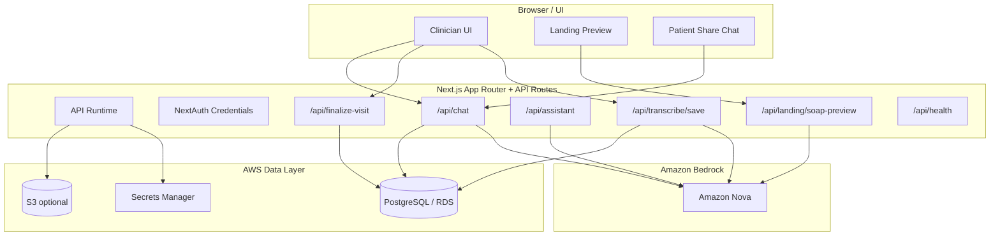

# Synth Nova (Amazon Nova Hackathon Build)

<p align="center">
  
</p>

<p align="center"><strong>Amazon Nova-powered clinical visit copilot for transcript summarization, SOAP note generation, and grounded patient-safe chat.</strong></p>

---

## Overview

Synth Nova is a hackathon-focused pivot of Synth for the Amazon Nova Hackathon.

It turns clinician-patient visit transcripts into structured clinical outputs and a patient-safe follow-up chat experience:

- transcript -> summary + SOAP notes
- clinician workflow for saved visits
- patient share link with grounded chat
- blood pressure trend extraction + visualization in chat
- AWS-ready deployment path (ECS + RDS + Bedrock)

This build is intentionally simplified for speed and reliability.

## Hackathon Readiness

- Recommended Devpost category: `Agentic AI`
- Submission deadline: March 16, 2026 at 5:00 PM PDT
- Public repo: `https://github.com/Manoj7ar/Synth-Hackathon`
- Demo credentials: `admin@synth.health` / `synth2025`

## Hackathon Pivot (What Changed)

This repo was refocused to optimize for a lean, demoable Generative AI submission:

- Amazon Nova (via Amazon Bedrock) replaces Gemini for text generation
- Elasticsearch/Kibana runtime integrations were removed
- Supabase runtime adapter was removed in favor of native Prisma + PostgreSQL
- Finalization/analytics flows were simplified to database-first behavior
- AWS deployment scaffolding was added (Docker + Terraform)

## Current Scope (Hackathon MVP)

### Included

- Clinician login (NextAuth credentials)
- Transcript save workflow
- Amazon Nova summary generation
- Amazon Nova SOAP note generation
- Patient share link flow
- Grounded patient-safe chat over visit context
- AWS deployment scaffold

### Intentionally De-scoped (for hackathon)

- Elasticsearch search/indexing/analytics
- Kibana Agent Builder tools/agents
- Server-side audio transcription (disabled in this build)
- Compliance-grade production hardening

## Important Demo Limitation

Server-side audio transcription is intentionally disabled in this Amazon Nova hackathon build.

Supported demo paths:

- browser live transcript in `/transcribe` (then save)
- transcript text / transcript file in landing preview (`/api/landing/soap-preview`)

## Architecture At A Glance



## Core User Flows

### 1) Transcript -> Save -> SOAP

1. Clinician records or pastes transcript text
2. `POST /api/transcribe/save` persists visit + documentation
3. Summary + SOAP notes are generated via Amazon Nova
4. User is routed to saved visit / SOAP note views

### 2) Patient Share Chat

1. Clinician finalizes visit and gets/creates share link
2. Patient opens `/patient/[shareToken]`
3. `POST /api/chat` loads visit context from DB
4. Amazon Nova generates grounded response
5. UI streams response with citations and optional BP trend visualization

## Tech Stack (Current)

### App

- Next.js 16 (App Router)
- React 19
- TypeScript
- Tailwind CSS v4
- Radix UI primitives
- NextAuth (credentials)

### AI

- Amazon Bedrock Runtime SDK (`@aws-sdk/client-bedrock-runtime`)
- Amazon Nova text models (configurable via env)

### Data

- Prisma ORM
- PostgreSQL (intended target: AWS RDS/Aurora PostgreSQL)

### Infra / Deployment

- Docker (Next.js standalone build)
- Terraform scaffold for AWS
- ECS Fargate + ALB + ECR + RDS + S3 + CloudWatch + Secrets Manager (scaffolded)

## Code Integration Map (Nova / AWS)

### Amazon Nova provider

- `src/lib/nova.ts`
  - Bedrock client initialization
  - Nova text generation helpers
  - model/env resolution integration

### Config / env helpers

- `src/lib/config.ts`
  - AWS region/model IDs
  - app version and readiness checks

### Clinical generation

- `src/lib/clinical-notes.ts`
  - conversation summary generation
  - SOAP note generation
  - deterministic fallbacks if Nova fails

### Chat runtime

- `src/app/api/chat/route.ts`
  - grounded clinician/patient responses
  - SSE streaming
  - citations + source details
  - BP trend visualization payload support

### DB runtime

- `src/lib/prisma.ts`
  - native Prisma client singleton (no Supabase runtime adapter)

### Local entity extraction (replaces Elastic ML dependency)

- `src/lib/clinical-entities.ts`
  - medication/symptom/procedure/vital extraction heuristics

### Health endpoint

- `src/app/api/health/route.ts`
  - readiness check for DB connectivity + Nova config presence

## Project Structure (Key Files)

```text
prisma/
  schema.prisma                  # PostgreSQL schema
  seed.ts                        # demo clinician + Sarah demo record seed

src/
  app/
    api/
      assistant/route.ts         # Nova-backed in-app assistant
      chat/route.ts              # grounded clinician/patient chat (Nova)
      finalize-visit/route.ts    # DB-only finalization + share link
      health/route.ts            # health/readiness endpoint
      landing/soap-preview/route.ts # transcript preview -> summary + SOAP
      transcribe/route.ts        # server audio transcription disabled (returns 503)
      transcribe/save/route.ts   # persist visit + docs
    patient/[shareToken]/page.tsx
    soap-notes/[visitId]/page.tsx
    transcribe/page.tsx
    visit/[visitId]/page.tsx

  lib/
    nova.ts                      # Amazon Nova / Bedrock provider
    config.ts                    # AWS/Nova env helpers
    clinical-notes.ts            # summary + SOAP generation
    clinical-entities.ts         # local extraction heuristics
    prisma.ts                    # native Prisma runtime client
```

## Environment Variables

Copy `.env.example` to `.env` and fill values.

### Required

```env
DATABASE_URL="postgresql://postgres:<PASSWORD>@<RDS_HOST>:5432/postgres"
DIRECT_URL="postgresql://postgres:<PASSWORD>@<RDS_HOST>:5432/postgres"

AWS_REGION=us-east-1
BEDROCK_NOVA_TEXT_MODEL_ID=amazon.nova-lite-v1:0
BEDROCK_NOVA_FAST_MODEL_ID=amazon.nova-micro-v1:0

NEXTAUTH_SECRET=...
NEXTAUTH_URL=http://localhost:3000
NEXT_PUBLIC_APP_URL=http://localhost:3000
```

### Optional / local dev only

```env
AWS_ACCESS_KEY_ID=
AWS_SECRET_ACCESS_KEY=
S3_BUCKET_AUDIO_UPLOADS=synth-nova-audio-dev
```

Notes:

- In AWS, prefer IAM task roles instead of access keys.
- Bedrock must be enabled in your AWS account/region and model access granted.

## Local Development

### Prerequisites

- Node.js 20+
- npm
- PostgreSQL (local or remote)
- AWS credentials with Bedrock access (for Nova generation)

### Install

```bash
npm install
```

### Database setup

```bash
npm run prisma:generate
npm run prisma:migrate
npm run prisma:seed
```

### Run app

```bash
npm run dev
```

Open `http://localhost:3000`.

## Default Seed Credentials

The seed script creates a demo clinician and Sarah walkthrough record.

- Email: `admin@synth.health`
- Password: `synth2025`
- Role: `clinician`

## Verification Commands

```bash
npm run lint
npx tsc --noEmit
npm run build
```

## API Surface (Current)

### Core workflow

- `POST /api/transcribe/save` - persist visit + transcript + generated docs
- `POST /api/finalize-visit` - finalize visit (DB-only path) + create share link
- `POST /api/landing/soap-preview` - transcript preview -> summary + SOAP (public demo endpoint)

### AI / chat

- `POST /api/chat` - grounded chat for clinician/patient-share flows
- `POST /api/assistant` - in-app navigation/assistant helper
- `POST /api/soap-actions/[visitId]/report` - Nova-generated visit report

### Utility

- `GET /api/analytics` - simplified DB-backed analytics payload (Elastic removed)
- `GET /api/health` - health/readiness metadata
- `POST /api/transcribe` - returns 503 (server audio transcription disabled in hackathon build)

## AWS Deployment (Production-ish Hackathon Target)

Target architecture (scaffolded in `infra/terraform/`):

- ECS Fargate (Next.js runtime)
- ALB
- ECR
- RDS PostgreSQL
- Amazon Bedrock (Nova)
- S3 (optional uploads/artifacts)
- Secrets Manager
- CloudWatch Logs

### Included deployment artifacts

- `Dockerfile`
- `.dockerignore`
- `infra/terraform/main.tf`
- `infra/terraform/variables.tf`
- `infra/terraform/outputs.tf`
- `infra/terraform/terraform.tfvars.example`
- `scripts/deploy/build-and-push.ps1`

### Manual steps still required

- fill Terraform variables (`vpc_id`, subnets, image URI, URLs, DB password)
- `terraform apply`
- write app secrets to Secrets Manager (`DATABASE_URL`, `DIRECT_URL`, `NEXTAUTH_SECRET`)
- run Prisma migrations against deployed DB (`npx prisma migrate deploy` recommended)
- confirm Bedrock model access and IAM permissions
- add HTTPS (ACM + ALB 443 listener) for a public demo domain

## Deployment / Build Notes

- `next.config.ts` uses `output: 'standalone'` for container deployment.
- Docker build copies `prisma/` before `npm install` because `postinstall` runs `prisma generate`.
- On Windows, Next standalone copy may emit a traced-file copy warning involving `:` in filenames even when build completes successfully.

## Troubleshooting

### AI generation is failing

Check:

- `AWS_REGION` is set
- Bedrock model IDs are valid for your region
- AWS credentials / task role permissions allow Bedrock invoke
- Bedrock model access is enabled in AWS console

### `/api/health` shows `novaConfigured=false`

- `AWS_REGION` is missing in runtime env

### `/api/health` shows `databaseReachable=false`

- verify `DATABASE_URL` and `DIRECT_URL`
- confirm Prisma migrations have been applied
- confirm the app can reach the PostgreSQL instance from the current network

### Database connection errors

Check:

- `DATABASE_URL` / `DIRECT_URL`
- RDS security groups and subnet routing
- Prisma migrations applied

### Server transcription returns 503

This is expected in the hackathon build.

Use:

- browser live transcript in `/transcribe`, or
- transcript text/file preview flow on landing preview

## Documentation

Detailed AWS/Nova integration documentation (replacement for the old Elastic deep dive):

- `AWS_AMAZON_NOVA_INTEGRATION_DEEP_DIVE.md`

Hackathon submission helper notes:

- `docs/HACKATHON_SUBMISSION.md`

## License

MIT (see `LICENSE`)
