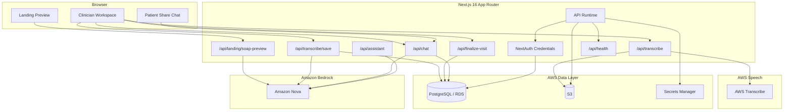

# Synth

<p align="center">
  
</p>

<p align="center">
  <strong>Amazon Nova-powered clinical documentation and patient follow-up assistant built for the AWS hackathon.</strong>
</p>

Synth is a full-stack clinical workflow application for turning visit conversations into structured clinical documentation and grounded patient follow-up. It combines a public transcript-to-SOAP preview, clinician visit workflows, patient share links, Amazon Nova generation, Prisma-backed clinician authentication, and AWS Transcribe-backed server audio processing.

The app is designed around an AWS-native runtime:

- Next.js on ECS Fargate
- Amazon Bedrock for Nova inference
- PostgreSQL on RDS
- Secrets Manager for runtime secrets
- S3 for upload/transcription storage
- CloudWatch for logs

## What Synth Does

- Converts visit transcripts into summaries and SOAP notes
- Supports transcript preview directly from the landing page
- Saves visit documentation for authenticated clinician workflows
- Creates patient share links for grounded post-visit chat
- Extracts blood pressure history across visits and visualizes trends in chat
- Supports Prisma-backed clinician authentication with NextAuth credentials sessions
- Supports AWS Transcribe-backed server audio transcription

## Product Flow

### Public preview

At `/`, Synth lets a reviewer paste a transcript or upload a transcript file and immediately generate:

- a parsed transcript view
- a conversation summary
- a SOAP note preview

### Clinician workflow

Authenticated clinicians can:

- sign in
- start a new visit
- capture audio or review transcript content
- transcribe recorded audio through AWS Transcribe
- generate and save documentation
- finalize the visit
- create a patient share link
- manage appointments, care plan items, and generated reports

### Patient follow-up

Patients open `/patient/[shareToken]` and chat with a grounded assistant that answers from:

- transcript content
- visit summary
- SOAP notes
- additional notes
- appointments
- care plan items
- blood pressure history across visits

## Architecture



## Stack

### Application

- Next.js 16
- React 19
- TypeScript
- Tailwind CSS v4
- Radix UI
- NextAuth

### AWS Services

- Amazon Bedrock
- Amazon Nova
- AWS Transcribe
- Amazon ECS Fargate
- Amazon RDS / Aurora PostgreSQL
- Amazon S3
- AWS Secrets Manager
- Amazon CloudWatch
- Amazon ECR
- ALB

### Data

- Prisma ORM
- PostgreSQL

## Core Routes

### Pages

- `/` - landing page transcript-to-SOAP preview
- `/login` - clinician sign-in
- `/clinician` - clinician workspace
- `/clinician/new-visit` - new visit flow
- `/transcribe` - audio and transcript workflow
- `/visit/[visitId]` - visit detail view
- `/soap-notes/[visitId]` - generated SOAP note view
- `/patient/[shareToken]` - patient-facing grounded chat

### APIs

- `POST /api/landing/soap-preview` - generate preview summary and SOAP notes from transcript input
- `POST /api/transcribe` - authenticated AWS Transcribe-backed server transcription
- `POST /api/transcribe/save` - persist visit and generated documentation
- `POST /api/finalize-visit` - finalize visit and create patient share flow
- `POST /api/chat` - grounded clinician/patient chat with streaming output
- `POST /api/assistant` - in-app AI assistant
- `GET /api/analytics` - analytics payload from database records
- `GET /api/health` - readiness and configuration check

## Data Model

The Prisma schema centers on:

- `User`
- `Patient`
- `Visit`
- `VisitDocumentation`
- `ShareLink`
- `Appointment`
- `CarePlanItem`
- `GeneratedReport`

`User` stores the clinician identity and profile fields used by the app, including:

- `passwordHash`
- `authProvider`

## Environment Variables

Copy `.env.example` to `.env` and fill the required values.

```env
# Database
DATABASE_URL="postgresql://postgres:<PASSWORD>@<RDS_HOST>:5432/postgres"
DIRECT_URL="postgresql://postgres:<PASSWORD>@<RDS_HOST>:5432/postgres"

# AWS / Bedrock
AWS_REGION=us-east-1
BEDROCK_NOVA_TEXT_MODEL_ID=amazon.nova-lite-v1:0
BEDROCK_NOVA_FAST_MODEL_ID=amazon.nova-micro-v1:0
TRANSCRIBE_LANGUAGE_CODE=en-US

# Local development only
AWS_ACCESS_KEY_ID=
AWS_SECRET_ACCESS_KEY=
S3_BUCKET_AUDIO_UPLOADS=synth-nova-audio-dev

# App URLs
NEXTAUTH_SECRET=your_random_secret_generate_with_openssl_rand_base64_32
NEXTAUTH_URL=http://localhost:3000
NEXT_PUBLIC_APP_URL=http://localhost:3000
```

Notes:

- Bedrock model access must be enabled in the target AWS account and region.
- AWS Transcribe requires `AWS_REGION` and `S3_BUCKET_AUDIO_UPLOADS`.
- For deployed AWS environments, prefer IAM roles over static keys.

## Local Development

### Prerequisites

- Node.js 20+
- npm
- PostgreSQL
- AWS credentials with Bedrock access

### Install

```bash
npm install
```

### Initialize the database

```bash
npm run prisma:generate
npm run prisma:migrate
npm run prisma:seed
```

Or:

```bash
npm run setup
```

### Run

```bash
npm run dev
```

Open `http://localhost:3000`.

## Demo Account

The seed script creates a demo clinician and walkthrough-ready demo visit.

- Email: `admin@synth.health`
- Password: `synth2025`

## Verification

```bash
npm run lint
npx tsc --noEmit
npm run build
```

## AWS Deployment

Deployment assets include:

- `Dockerfile`
- `infra/terraform/main.tf`
- `infra/terraform/variables.tf`
- `infra/terraform/outputs.tf`
- `infra/terraform/terraform.tfvars.example`
- `scripts/deploy/build-and-push.ps1`
- `scripts/deploy/set-app-secrets.ps1`
- `docs/AWS_DEPLOYMENT_CHECKLIST.md`

Current Terraform scaffolding covers:

- ECS Fargate
- ECR
- ALB
- VPC, public subnets, private subnets, and NAT
- RDS PostgreSQL
- S3
- CloudWatch Logs
- Secrets Manager
- IAM for Bedrock, S3, and Transcribe
- generated DB password and NextAuth secret for the default deploy path

Typical deploy flow:

1. Build and push the container image.
2. Fill Terraform variables, leaving networking and URLs blank if you want the default AWS-created setup.
3. Apply infrastructure.
4. Run Prisma migrations against the deployed database.
5. Override generated secrets only if needed.
6. Validate `/api/health`, auth, transcription, save flow, and patient chat.

## Additional Documentation

- `AWS_AMAZON_NOVA_INTEGRATION_DEEP_DIVE.md`
- `docs/AWS_DEPLOYMENT_CHECKLIST.md`
- `docs/HACKATHON_SUBMISSION.md`
- `infra/terraform/README.md`

## License

MIT. See `LICENSE`.
