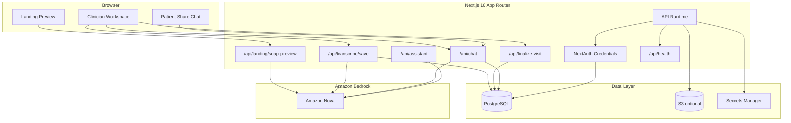

# Synth

<p align="center">
  
</p>

<p align="center">
  <strong>Amazon Nova-powered clinical documentation and patient follow-up assistant built for the AWS hackathon.</strong>
</p>

Synth is a full-stack clinical workflow app designed for fast, high-signal visit documentation. Clinicians can capture or paste visit transcripts, generate structured summaries and SOAP notes, save the encounter, and share a grounded patient follow-up experience that answers questions from the actual visit record.

The application is built around Amazon Bedrock and Amazon Nova, with a Next.js frontend, Prisma + PostgreSQL data layer, and AWS deployment scaffolding for a clean hackathon demo path.

## What Synth Does

- Turns visit transcripts into structured clinical summaries and SOAP notes
- Supports transcript preview directly from the landing page
- Saves visits for authenticated clinician workflows
- Creates patient share links for grounded follow-up chat
- Surfaces care plan items, reports, appointments, and visit context in one app
- Extracts blood pressure history from visit records and visualizes trends in chat
- Includes Docker and Terraform scaffolding for AWS deployment

## Demo Flow

### Public landing experience

At `/`, Synth lets judges or reviewers paste a transcript or upload a transcript file and instantly generate:

- a parsed transcript view
- a conversation summary
- a SOAP note preview

This gives the project a low-friction entry point without requiring sign-in.

### Clinician workflow

Authenticated clinicians can:

- sign in with credentials auth
- start a new visit
- capture or edit transcript content
- generate and save documentation
- review visit details and SOAP notes
- finalize the visit
- create a patient share link
- manage follow-up items like appointments, care plan items, and generated reports

### Patient follow-up experience

Patients open a share link at `/patient/[shareToken]` and chat with a grounded assistant that answers from:

- transcript content
- visit summary
- SOAP notes
- additional notes
- appointments
- care plan items
- blood pressure history across visits

When the question asks for blood pressure comparisons or trends, Synth can attach a chart based on extracted readings from the visit record.

## Architecture



## Stack

### Application

- Next.js 16
- React 19
- TypeScript
- Tailwind CSS v4
- Radix UI
- NextAuth

### AI

- Amazon Bedrock Runtime SDK
- Amazon Nova text models

### Data

- Prisma ORM
- PostgreSQL

### Deployment

- Docker
- Terraform
- AWS ECS Fargate
- Amazon RDS / Aurora PostgreSQL
- ECR
- ALB
- CloudWatch
- Secrets Manager

## Core Routes

### Pages

- `/` - landing page with transcript-to-SOAP preview
- `/login` - clinician sign-in
- `/clinician` - clinician workspace
- `/clinician/new-visit` - new visit flow
- `/transcribe` - transcript workflow
- `/visit/[visitId]` - visit detail view
- `/soap-notes/[visitId]` - generated SOAP note view
- `/patient/[shareToken]` - patient-facing grounded chat

### APIs

- `POST /api/landing/soap-preview` - generate preview summary and SOAP notes from transcript input
- `POST /api/transcribe/save` - persist visit and generated documentation
- `POST /api/finalize-visit` - finalize visit and create patient share flow
- `POST /api/chat` - grounded clinician/patient chat with streaming output
- `POST /api/assistant` - in-app AI assistant
- `GET /api/analytics` - analytics payload from database records
- `GET /api/health` - readiness and configuration check
- `POST /api/transcribe` - authenticated endpoint reserved for server transcription flow

## Data Model

The Prisma schema centers on these entities:

- `User`
- `Patient`
- `Visit`
- `VisitDocumentation`
- `ShareLink`
- `Appointment`
- `CarePlanItem`
- `GeneratedReport`

This keeps the hackathon story straightforward: one system to capture a visit, structure it, store it, and extend it into patient follow-up.

## Project Structure

```text
prisma/
  schema.prisma
  seed.ts

src/
  app/
    api/
      assistant/route.ts
      chat/route.ts
      finalize-visit/route.ts
      health/route.ts
      landing/soap-preview/route.ts
      transcribe/route.ts
      transcribe/save/route.ts
    clinician/
    patient/[shareToken]/
    soap-notes/[visitId]/
    transcribe/
    visit/[visitId]/

  components/
    landing/
    clinician/
    patient/
    soap-notes/
    transcribe/
    chat/

  lib/
    auth.ts
    clinical-entities.ts
    clinical-notes.ts
    config.ts
    nova.ts
    prisma.ts

infra/
  terraform/

scripts/
  deploy/
```

## Environment Variables

Copy `.env.example` to `.env` and fill in the required values.

```env
# Database
DATABASE_URL="postgresql://postgres:<PASSWORD>@<RDS_HOST>:5432/postgres"
DIRECT_URL="postgresql://postgres:<PASSWORD>@<RDS_HOST>:5432/postgres"

# AWS / Bedrock
AWS_REGION=us-east-1
BEDROCK_NOVA_TEXT_MODEL_ID=amazon.nova-lite-v1:0
BEDROCK_NOVA_FAST_MODEL_ID=amazon.nova-micro-v1:0

# Optional for local development
AWS_ACCESS_KEY_ID=
AWS_SECRET_ACCESS_KEY=
S3_BUCKET_AUDIO_UPLOADS=synth-nova-audio-dev

# Auth / app URLs
NEXTAUTH_SECRET=your_random_secret_generate_with_openssl_rand_base64_32
NEXTAUTH_URL=http://localhost:3000
NEXT_PUBLIC_APP_URL=http://localhost:3000
```

Notes:

- Bedrock model access must be enabled in the AWS account and region you use.
- For deployed AWS environments, prefer IAM roles over static access keys.

## Local Development

### Prerequisites

- Node.js 20+
- npm
- PostgreSQL
- AWS credentials with Bedrock access

### Install dependencies

```bash
npm install
```

### Initialize the database

```bash
npm run prisma:generate
npm run prisma:migrate
npm run prisma:seed
```

Or run the combined setup command:

```bash
npm run setup
```

### Start the app

```bash
npm run dev
```

Open `http://localhost:3000`.

## Seeded Demo Account

The seed script creates a demo clinician account and a walkthrough-ready demo visit.

- Email: `admin@synth.health`
- Password: `synth2025`

## Verification

```bash
npm run lint
npx tsc --noEmit
npm run build
```

## AWS Deployment

AWS deployment scaffolding lives in `infra/terraform/` and targets a practical hackathon-ready stack:

- ECS Fargate for the Next.js runtime
- ECR for container images
- ALB for public traffic
- PostgreSQL on RDS
- Amazon Bedrock for Nova inference
- Secrets Manager for runtime secrets
- CloudWatch Logs for application logging
- S3 for optional file storage

Included deployment assets:

- `Dockerfile`
- `.dockerignore`
- `infra/terraform/main.tf`
- `infra/terraform/variables.tf`
- `infra/terraform/outputs.tf`
- `infra/terraform/terraform.tfvars.example`
- `scripts/deploy/build-and-push.ps1`

Typical deploy flow:

1. Build and push the container image.
2. Fill Terraform variables for VPC, subnets, image URI, database credentials, and public URLs.
3. Apply Terraform.
4. Add runtime secrets such as `DATABASE_URL`, `DIRECT_URL`, and `NEXTAUTH_SECRET`.
5. Run Prisma migrations against the deployed database.
6. Confirm Bedrock model access and IAM permissions.

## Notes for Judges and Reviewers

- The fastest demo path is the landing page transcript preview.
- The full product story is unlocked after clinician sign-in.
- Patient chat is grounded in saved visit data, not free-form generic responses.
- Blood pressure trend visualization is generated from extracted readings across visit history.

## Additional Documentation

- `AWS_AMAZON_NOVA_INTEGRATION_DEEP_DIVE.md`
- `docs/HACKATHON_SUBMISSION.md`
- `infra/terraform/README.md`

## License

MIT. See `LICENSE`.
