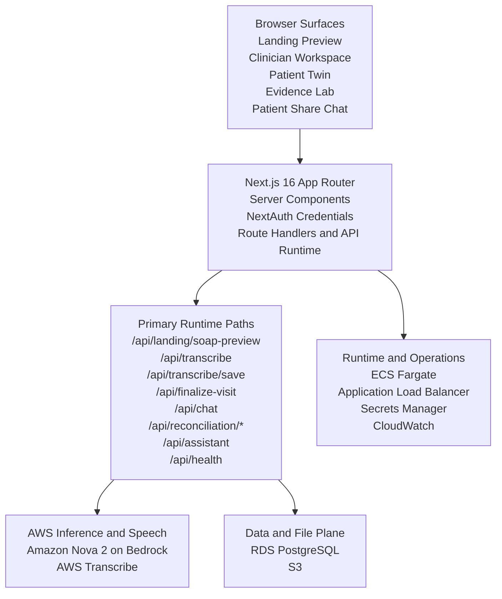
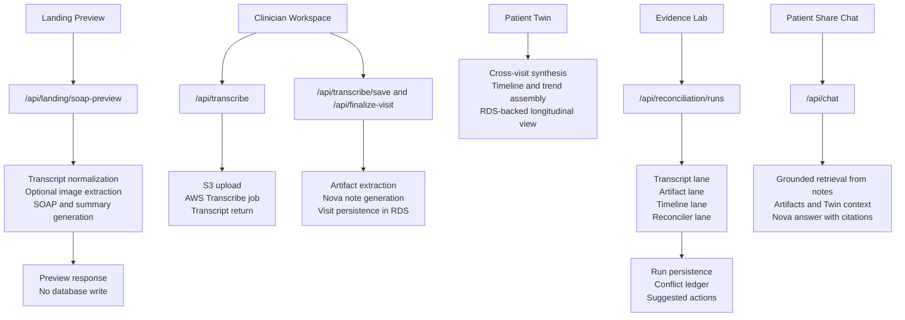

# Synth

<p align="center">
  
</p>

<p align="center">
  <strong>Amazon Nova-powered multimodal clinical evidence copilot built for the AWS hackathon.</strong>
</p>

Synth is a full-stack clinical workflow application for turning visit conversations and supporting evidence into structured documentation, longitudinal patient memory, and grounded follow-up actions.

The product is built around five connected surfaces:

- public transcript or audio to SOAP preview
- clinician visit capture and save flow
- multimodal evidence artifacts such as BP logs and medication bottle photos
- Patient Twin for cross-visit memory and trend synthesis
- Evidence Lab for reconciliation, conflict review, and chart-ready approvals

## What Synth Does

- Generates visit summaries and SOAP notes from transcripts with Amazon Nova
- Supports landing-page preview from transcript text or audio, with optional image evidence
- Extracts structured evidence from uploaded clinical images such as BP logs, medication labels, and lab photos
- Persists visit documentation, evidence artifacts, share links, appointments, care-plan items, and reports
- Builds a longitudinal Patient Twin across saved visits
- Runs an Evidence Lab reconciliation workflow across transcript, artifact, and timeline evidence
- Lets clinicians approve suggested actions into real `CarePlanItem` and `Appointment` records
- Supports grounded patient follow-up chat from saved visit data
- Uses AWS Transcribe for server-side audio transcription when configured

## Why It Matters

Clinical documentation, follow-up planning, and evidence review are usually fragmented across notes, images, logs, and memory. Synth compresses that flow into one application:

- the clinician can move from raw visit evidence to structured documentation faster
- patient follow-up stays grounded in the saved record instead of generic chat behavior
- longitudinal trends and unresolved risks stay visible across visits
- the AWS stack is part of the runtime, not just hosting, through Nova, Transcribe, S3, ECS, RDS, and Secrets Manager

## Product Surfaces

### Public preview

At `/`, a reviewer can:

- paste transcript text
- upload an audio file for server transcription
- optionally attach one clinical evidence image

Synth returns:

- normalized transcript segments
- a conversation summary
- a SOAP note preview
- extracted artifact findings when an image is attached

### Clinician workflow

Authenticated clinicians can:

- sign in with credentials-based auth
- start a new visit or work from saved visits
- transcribe recorded audio through AWS Transcribe
- generate and save summary plus SOAP documentation
- attach and persist image evidence artifacts
- finalize the visit
- create appointments, care-plan items, and reports
- open the patient share flow

### Patient Twin

`/patient-twin` and `/patient-twin/[patientId]` provide a longitudinal view of one patient:

- cross-visit timeline
- medication history
- BP trend signals
- evidence-backed insights
- follow-up risks and open questions
- Twin-grounded clinician chat

### Evidence Lab

`/reconciliation` and `/reconciliation/[patientId]` provide the judge-facing arbitration surface:

- persisted reconciliation runs
- separate transcript, artifact, timeline, and reconciler outputs
- confidence scoring and conflict ledger
- suggested actions that can be approved into live chart records

### Patient follow-up

Patients open `/patient/[shareToken]` and chat with a grounded assistant that answers from:

- transcript content
- summary and SOAP notes
- uploaded evidence artifacts
- additional notes
- appointments
- care-plan items
- cross-visit BP history when available

## Best Demo Path

The fastest way to understand the project is:

1. Open `/` and generate a preview from transcript text or audio plus an evidence image.
2. Sign in as the demo clinician.
3. Open Sarah Johnson in `Patient Twin`.
4. Open Sarah Johnson in `Evidence Lab`.
5. Run a new reconciliation pass and inspect the conflict ledger.
6. Approve a suggested action into the live chart.
7. Open the latest SOAP note and the patient follow-up flow.

## Architecture

This uses a vertical layout so the diagram stays readable in standard Markdown previews.

### Stack View



### Request Path View



## Stack

### Application

- Next.js 16
- React 19
- TypeScript
- Tailwind CSS v4
- Radix UI
- NextAuth

### AWS services

- Amazon Bedrock
- Amazon Nova 2
- AWS Transcribe
- Amazon ECS Fargate
- Amazon RDS / PostgreSQL
- Amazon S3
- AWS Secrets Manager
- Amazon CloudWatch
- Amazon ECR
- Application Load Balancer

### Data layer

- Prisma ORM
- PostgreSQL

## Core Routes

### Pages

- `/` - landing page preview
- `/login` - clinician sign-in
- `/clinician` - clinician workspace
- `/clinician/new-visit` - visit entry flow
- `/clinician/onboarding` - clinician profile setup
- `/transcribe` - audio and transcript workflow
- `/soap-notes` - saved notes index
- `/soap-notes/[visitId]` - saved SOAP and evidence view
- `/patient-twin` - Patient Twin index
- `/patient-twin/[patientId]` - longitudinal patient view
- `/reconciliation` - Evidence Lab index
- `/reconciliation/[patientId]` - reconciliation workspace
- `/patient/[shareToken]` - patient-facing grounded chat

### APIs

- `POST /api/landing/soap-preview` - transcript or audio preview with optional image evidence
- `POST /api/transcribe` - authenticated AWS Transcribe-backed server transcription
- `POST /api/transcribe/save` - persist visit documentation and evidence artifacts
- `POST /api/finalize-visit` - finalize visit and generate deterministic follow-up artifacts
- `POST /api/chat` - grounded clinician or patient chat
- `POST /api/assistant` - in-app navigation and workflow assistant
- `GET /api/reconciliation/runs` - list reconciliation runs for a patient
- `POST /api/reconciliation/runs` - create a new reconciliation run
- `GET /api/reconciliation/runs/[runId]` - fetch one reconciliation run
- `POST /api/reconciliation/runs/[runId]/actions/[actionId]` - approve or dismiss a suggested action
- `GET /api/analytics` - analytics payload from saved database records
- `GET /api/health` - readiness and configuration status

## Data Model

The Prisma schema centers on these core entities:

- `User`
- `Patient`
- `Visit`
- `VisitDocumentation`
- `VisitArtifact`
- `ShareLink`
- `Appointment`
- `CarePlanItem`
- `GeneratedReport`
- `ReconciliationRun`
- `ReconciliationAgentOutput`
- `ReconciliationAction`

Notable design details:

- `VisitDocumentation.transcriptJson` stores normalized transcript segments as JSON text
- `VisitArtifact` stores extracted image evidence and structured findings
- `ReconciliationAction` can write into `CarePlanItem` or `Appointment`
- `sourceActionId` on care-plan and appointment records makes Evidence Lab approvals idempotent

## Configuration

Copy `.env.example` to `.env` and fill the required values.

```env
# Database
DATABASE_URL="postgresql://postgres:<PASSWORD>@<RDS_HOST>:5432/postgres"
DIRECT_URL="postgresql://postgres:<PASSWORD>@<RDS_HOST>:5432/postgres"

# AWS / Bedrock
AWS_REGION=us-east-1
BEDROCK_NOVA_TEXT_MODEL_ID=us.amazon.nova-2-lite-v1:0
BEDROCK_NOVA_FAST_MODEL_ID=us.amazon.nova-2-lite-v1:0
BEDROCK_NOVA_MULTIMODAL_MODEL_ID=us.amazon.nova-2-lite-v1:0
TRANSCRIBE_LANGUAGE_CODE=en-US

# Local development only
AWS_ACCESS_KEY_ID=
AWS_SECRET_ACCESS_KEY=
S3_BUCKET_AUDIO_UPLOADS=synth-nova-audio-dev

# App URLs
NEXTAUTH_SECRET=your_random_secret_generate_with_openssl_rand_base64_32
NEXTAUTH_URL=http://localhost:3000
NEXT_PUBLIC_APP_URL=http://localhost:3000
```

Notes:

- Bedrock model access must be enabled in the target AWS account and region.
- AWS Transcribe requires `AWS_REGION` and `S3_BUCKET_AUDIO_UPLOADS`.
- `GET /api/health` reports database, auth, Nova, public URL, and transcription readiness.
- In deployed AWS environments, prefer IAM roles over static access keys.

## Local Development

### Prerequisites

- Node.js 20+
- npm
- PostgreSQL
- AWS credentials with Bedrock access

### Install

```bash
npm install
```

### Initialize the database

```bash
npm run prisma:generate
npm run prisma:migrate
npm run prisma:seed
```

Or:

```bash
npm run setup
```

### Run

```bash
npm run dev
```

Open `http://localhost:3000`.

If `3000` is already in use:

```bash
npm run dev -- --port 3001
```

If you change the port locally, update `NEXTAUTH_URL` and `NEXT_PUBLIC_APP_URL` to match.

## Demo Account

The seed script creates a clinician demo account and a seeded longitudinal Sarah Johnson journey.

- Email: `admin@synth.health`
- Password: `synth2025`

The seeded judge path includes:

- multiple Sarah Johnson visits
- multimodal evidence artifacts
- Patient Twin timeline and BP trend
- Evidence Lab reconciliation runs

## What Is Real vs Fallback

This codebase intentionally favors a working demo path over hard failure in every degraded environment.

- Summary and SOAP generation use Amazon Nova when configured.
- Image evidence extraction uses Amazon Nova multimodal when configured, and falls back to conservative artifact placeholders otherwise.
- Audio preview and server transcription require AWS Transcribe plus S3.
- Patient Twin is built from persisted visit data and deterministic synthesis.
- Evidence Lab persists separate reconciliation lanes; the final consensus summary can use Nova, while several supporting claims are derived heuristically from saved evidence and timeline data.

For hackathon judging, the intended deployment is an AWS-configured environment with Nova and Transcribe enabled.

## Verification

```bash
npm run lint
npx tsc --noEmit
npm run build
npm run prisma:seed
```

## AWS Deployment

Current Terraform scaffolding covers:

- ECS Fargate
- ECR
- ALB
- VPC, subnets, and NAT
- RDS PostgreSQL
- S3
- CloudWatch Logs
- Secrets Manager
- IAM for Bedrock, S3, and Transcribe

Fast-start deployment flow:

1. Build and push the container image.
2. Fill Terraform variables.
3. Apply infrastructure.
4. Run Prisma migrations against the deployed database.
5. Configure runtime secrets and URLs.
6. Validate `/api/health`, auth, preview, Patient Twin, Evidence Lab, and patient chat.

Deployment assets:

- `Dockerfile`
- `infra/terraform/main.tf`
- `infra/terraform/variables.tf`
- `infra/terraform/outputs.tf`
- `infra/terraform/terraform.tfvars.example`
- `scripts/deploy/build-and-push.ps1`
- `scripts/deploy/set-app-secrets.ps1`

## Additional Documentation

- `AWS_AMAZON_NOVA_INTEGRATION_DEEP_DIVE.md` - technical architecture, runtime flow, and data model
- `infra/terraform/README.md`

## License

MIT. See `LICENSE`.
